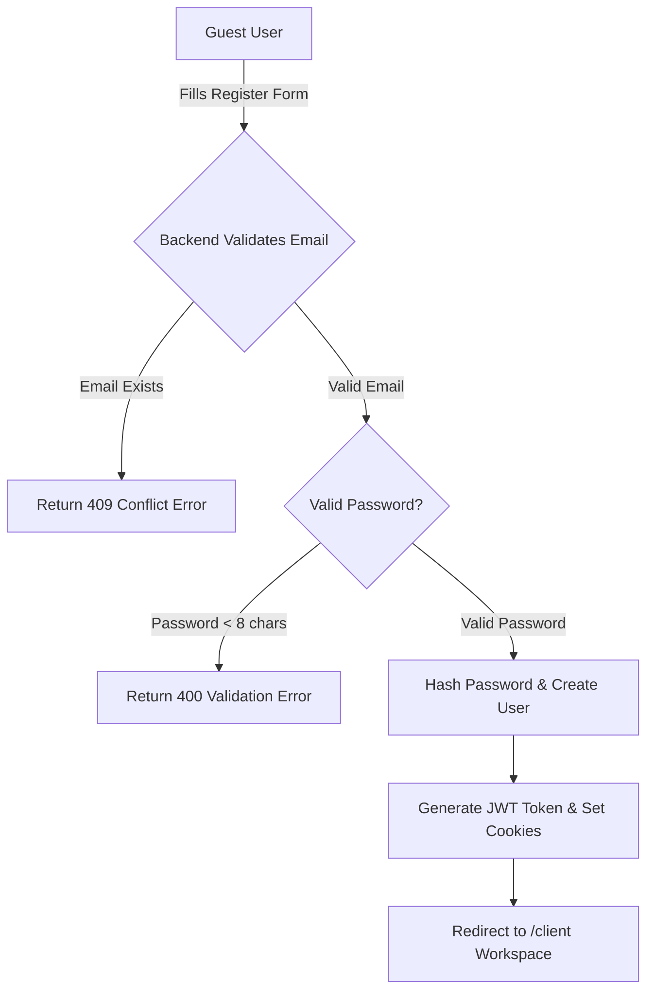
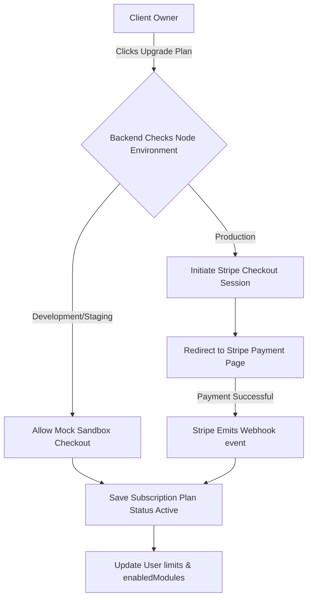
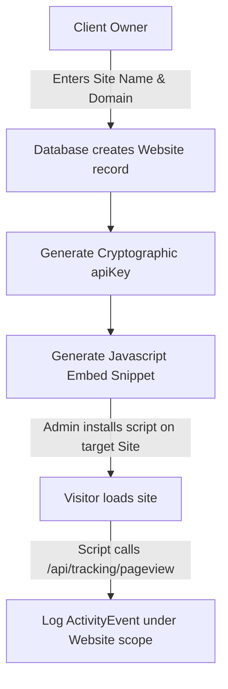
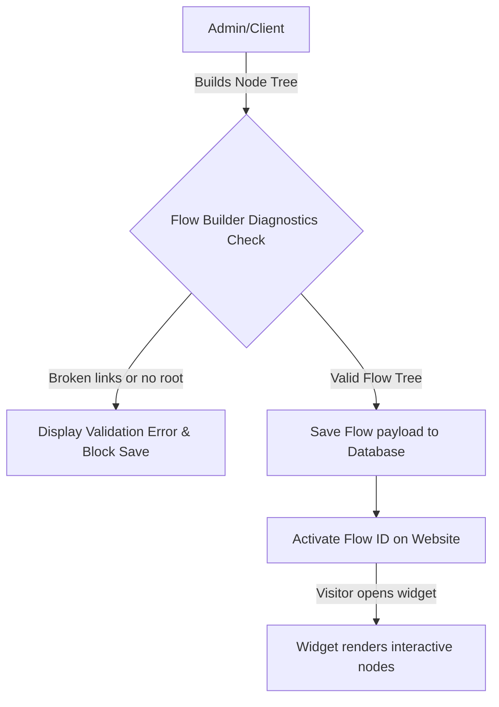
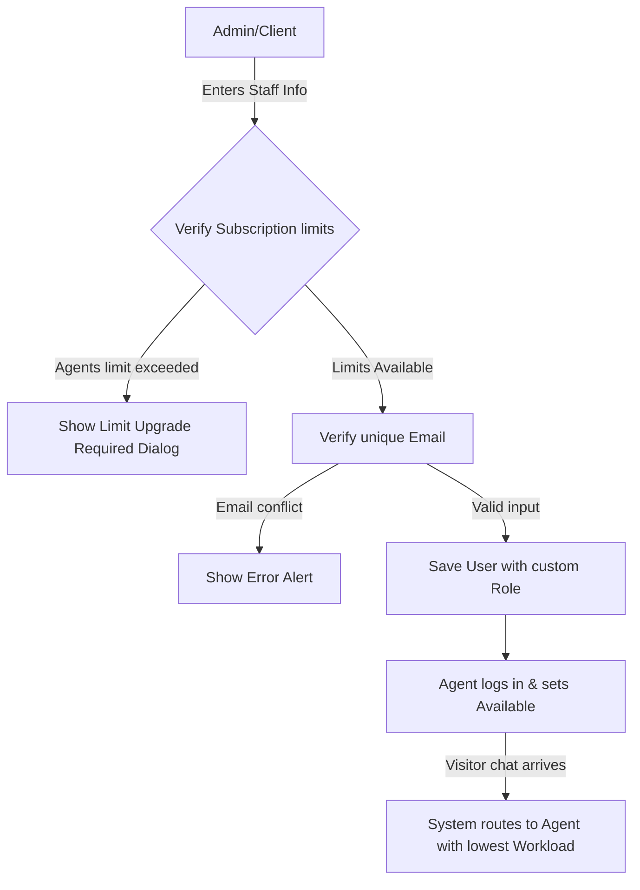
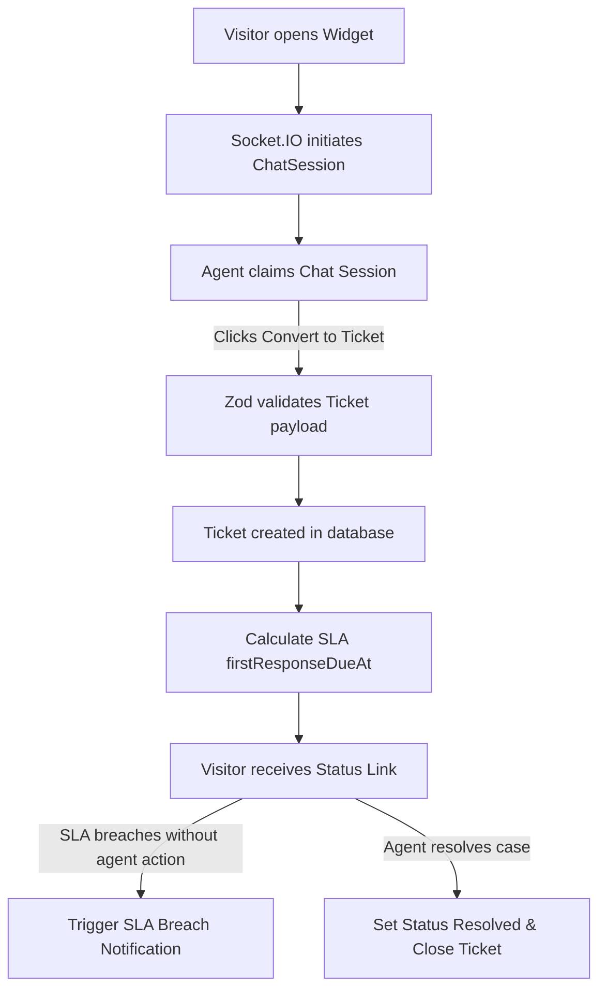
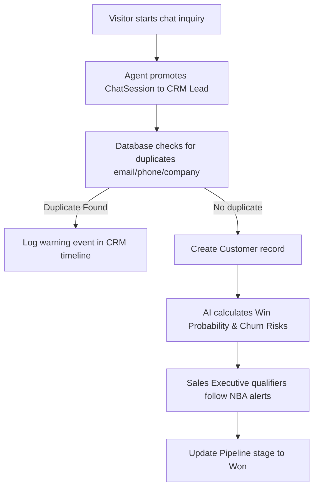
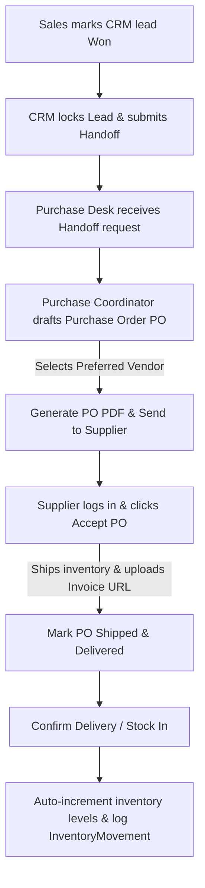
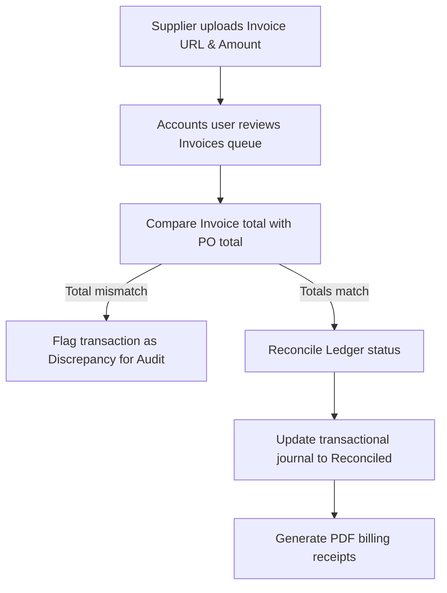
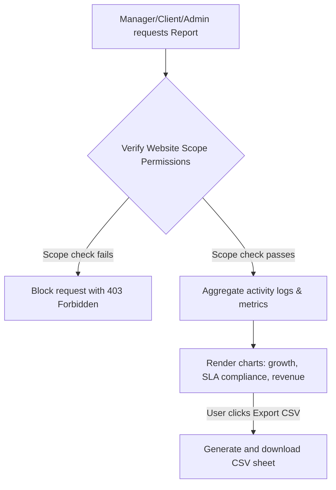

# Platform Workflow Journeys

This document details the core workflows and end-to-end user journeys implemented in JTS Chat Support. It outlines flow diagrams, decision points, validations, success scenarios, failure scenarios, permissions, dependencies, and business rules for each process.

---

## 1. User Registration & Client Account Setup

### Overview
The starting point for a new tenant client account. This workflow registers a client user, allocates a tenant space, and directs them to setup pages.

### Flow Diagram

### Details
-   **Decision Points**: Whether to register as a client (self-service) or sign in as an existing user.
-   **Validations**:
    -   *Frontend*: Matches format validations for email structure and password matching.
    -   *Backend*: Mongoose database checks for unique email indexes. Password length checked on controllers.
-   **Success Scenario**: User registration completes, database adds Client profile with Pro-tier defaults, dashboard redirects to `/client`.
-   **Failure Scenario**: Conflict exceptions (409) if the email address is already registered; rate limits lock (429) if requests exceed 5 attempts in 15 minutes.
-   **Permissions**: Publicly accessible.
-   **Dependencies**: MongoDB (`User` collection).
-   **Business Rules**: Public sign-ups are assigned the `client` role. Max login lock is 5 attempts per 15 minutes.

---

## 2. Subscription Upgrade & Feature Gating

### Overview
Gating platform modules and resource limits based on subscription tier status.

### Flow Diagram

### Details
-   **Decision Points**: Choose Basic, Standard, or Pro pricing tier; select Stripe gateway vs Mock Sandbox checkout.
-   **Validations**:
    -   Price ID matches configured environment keys.
    -   Verify customer user signature on Stripe webhook.
-   **Success Scenario**: Payment completes, subscription status updates to `active`, limits increment (e.g. 20 agents, 10 sites for Pro), and CRM/ticket tabs unlock in the UI.
-   **Failure Scenario**: Stripe webhook signature verification fails (400), card declined by gateway, or mock billing attempted in a production environment (blocked with a 403 response).
-   **Permissions**: Client, Admin roles.
-   **Dependencies**: Stripe Payment Gateway, Stripe Webhook endpoints.
-   **Business Rules**:
    -   *Basic*: Chat, Shortcuts, Security. Limits: 2 agents, 1 website.
    -   *Standard*: Chat, Tickets, Shortcuts, Reports, Security. Limits: 5 agents, 2 websites.
    -   *Pro*: Chat, Tickets, CRM, Shortcuts, Reports, Security. Limits: 20 agents, 10 websites.

---

## 3. Website Configuration & Tracking Snippet Deployment

### Overview
Connecting client website domains to JTS Chat Support using embed scripts and API keys.

### Flow Diagram

### Details
-   **Decision Points**: Allocate domain names, select colors, set welcome messages.
-   **Validations**: Checks domain format and ensures unique website ID.
-   **Success Scenario**: API key generated, snippet copied to client site, visitor hits are recorded as `page_view` events in the database.
-   **Failure Scenario**: Widget requests blocked by CORS rules if the origin header does not match client domain listings.
-   **Permissions**: Client, Admin roles.
-   **Dependencies**: Mongoose `Website` model, Express static served public folder.

---

## 4. Visual Flow Builder & Custom Bot Deployment

### Overview
Designing the visual node tree configurations for automated visitor widget onboarding flows.

### Flow Diagram

### Details
-   **Decision Points**: Construct Message, Button, Form, Action, or Condition nodes.
-   **Validations**:
    -   *Root Node Validation*: Checks if a node named `root` exists.
    -   *Broken Link Check*: Checks if any node refers to a missing next node.
    -   *Orphan Check*: Identifies nodes that are not linked from other nodes.
-   **Success Scenario**: Flow is published, visitor widget loads visual buttons and custom forms.
-   **Failure Scenario**: Validation errors (e.g. broken node link) block save operations.
-   **Permissions**: Client, Admin roles.
-   **Dependencies**: `Flow` and `Website` schemas.

---

## 5. Staff Account Creation & Workload Balance

### Overview
Inviting team members, assigning security roles, selecting website scopes, and auto-balancing active queue routing.

### Flow Diagram

### Details
-   **Decision Points**: Select role (Agent, Manager, Sales, etc.), max concurrent workload, assigned website checkmarks.
-   **Validations**: Checks unique email index, confirms role value exists in Role database, limits max workload value to integers.
-   **Success Scenario**: Agent profile is active, logs in, sets availability to online, and receives incoming chats.
-   **Failure Scenario**: User creation fails if active agents count is equal to the subscription limit.
-   **Permissions**: Client, Admin roles.
-   **Dependencies**: `Role` and `User` database models.
-   **Business Rules**: Chats are routed to online agents who have not reached their `maxWorkload` limit, prioritizing agents with the lowest current workload.

---

## 6. Live Chat to Ticket Lifecycle & SLA Escalations

### Overview
Converting a live visitor session to a support ticket, tracking SLA compliance, and monitoring ticket lifecycle stages.

### Flow Diagram

### Details
-   **Decision Points**: Set ticket priority (low, medium, high, urgent), categorize issue, and assign to departments.
-   **Validations**: Zod validation checks for required subject lines, valid category IDs, and website scopes.
-   **Success Scenario**: Ticket is created, visitor receives a tracking link, agent updates status to resolved, and SLA stopwatch resets.
-   **Failure Scenario**: Target ticket fields fail schema validation, or agent attempts to convert a deleted chat session.
-   **Permissions**: Any authenticated dashboard user (Agent, Sales, Manager, Client, Admin).
-   **Dependencies**: `Ticket`, `ChatSession`, and `Visitor` database models.
-   **Business Rules**:
    -   *First Response SLA*: Countdown duration configured in minutes (`SLA_QUEUE_ALERT_MINUTES`).
    -   *Resolution SLA*: Countdown duration configured in hours (`SLA_TICKET_ALERT_HOURS`).
    -   Breached tickets are colored red in the UI and trigger alerts to managers.

---

## 7. Live Chat to Sales CRM Lead Qualification

### Overview
Promoting website visitors to CRM sales leads, analyzing engagement metrics, and moving prospects through the pipeline.

### Flow Diagram

### Details
-   **Decision Points**: Decide deal value, interest levels, expected close date, and pipeline stage (New, Contacted, Qualified, Proposal, Negotiation, Won, Lost).
-   **Validations**:
    -   Checks duplicate entries based on email and phone numbers.
    -   Verifies expected close date is a future date.
-   **Success Scenario**: Lead card appears on the Sales Kanban board, AI recommendations display, and the sales executive updates follow-up tasks.
-   **Failure Scenario**: Lead update fails if the sales user does not have permission to modify active deals.
-   **Permissions**: Sales, Manager, Client, Admin roles.
-   **Dependencies**: `Customer`, `FollowUpTask`, and `Message` models.
-   **Business Rules**: If a lead remains unowned or has no logged interactions for `CRM_LEAD_REASSIGN_MINUTES`, the backend automatically reassigns it to another active sales owner.

---

## 8. CRM Won Deals to Procurement and Vendor Fulfillment

### Overview
Transitioning won sales contracts to the Procurement workspace, ordering inventory from preferred suppliers, and updating stock levels.

### Flow Diagram

### Details
-   **Decision Points**: Create direct Purchase Order (PO) to preferred supplier or submit Request for Quotations (RFQ) to multiple suppliers.
-   **Validations**:
    -   Verify the selected vendor is active.
    -   Ensure purchase order details match inventory SKU configurations.
-   **Success Scenario**: Supplier fulfills the PO, uploads a digital invoice link, the purchase desk confirms delivery, and inventory stock balances auto-increment.
-   **Failure Scenario**: Purchase order generation is blocked if the associated CRM deal is not in the *Won* stage or is missing financial parameters.
-   **Permissions**: Sales (Won stage updates), Purchase (PO drafting, Stock In), Supplier (PO acceptance, invoice upload).
-   **Dependencies**: `PurchaseOrder`, `Supplier`, `InventoryItem`, and `InventoryMovement` schemas.
-   **Business Rules**: PO delivery confirmation triggers an automatic `in` type `InventoryMovement` entry, updating stock balances in the item master.

---

## 9. Invoice Verification & Financial Ledger Reconciliation

### Overview
Processing customer-facing invoices and reconciling incoming supplier invoices against purchase order registers in the financial ledger.

### Flow Diagram

### Details
-   **Decision Points**: Confirm payment reconciliation; flag discrepant transactions.
-   **Validations**: Checks that the uploaded invoice amount matches the associated PO total.
-   **Success Scenario**: Transaction matches, ledger status updates to *Reconciled*, expense journal records update, and receipt PDFs are generated.
-   **Failure Scenario**: Mismatched totals block automatic reconciliation and flag the transaction in the ledger tab.
-   **Permissions**: Accounts, Client, Admin roles.
-   **Dependencies**: `Invoice`, `PurchaseOrder`, and `User` (Billing profiles) models.
-   **Business Rules**: Discrepant invoices are highlighted in red on the ledger dashboard and require manual override by an Accounts user or Administrator.

---

## 10. Performance Reporting & Data Exports

### Overview
Aggregating conversation wait times, SLA breaches, sales revenue, and supplier fulfillment metrics to generate export-ready reports.

### Flow Diagram

### Details
-   **Decision Points**: Select date range preset (7d, 30d, 90d, custom), filter by website domain, and group by agent or supplier.
-   **Validations**: Verify that the user has permission to access the requested website scope.
-   **Success Scenario**: Charts populate, and CSV download matches the selected filters.
-   **Failure Scenario**: Empty analytics dashboards if query timestamps fall outside database ranges.
-   **Permissions**: Manager, Accounts, Client, Admin roles.
-   **Dependencies**: `ActivityEvent`, `ChatSession`, `Ticket`, and `Invoice` schemas.
-   **Business Rules**: Enterprise data is aggregated on demand. The client scope is restricted to their website IDs; global admins can query data across all tenants.

---

## Related Articles
*   [Quick Start Role Guide](file:///e:/Chat%20Support/Documentation/01_Getting_Started/02_quick_start.md)
*   [Sales Lead Pipelines](file:///e:/Chat%20Support/Documentation/13_CRM/01_lead_pipeline.md)
*   [Support Ticket SLA Management Policies](file:///e:/Chat%20Support/Documentation/14_Tickets/02_sla_management.md)
