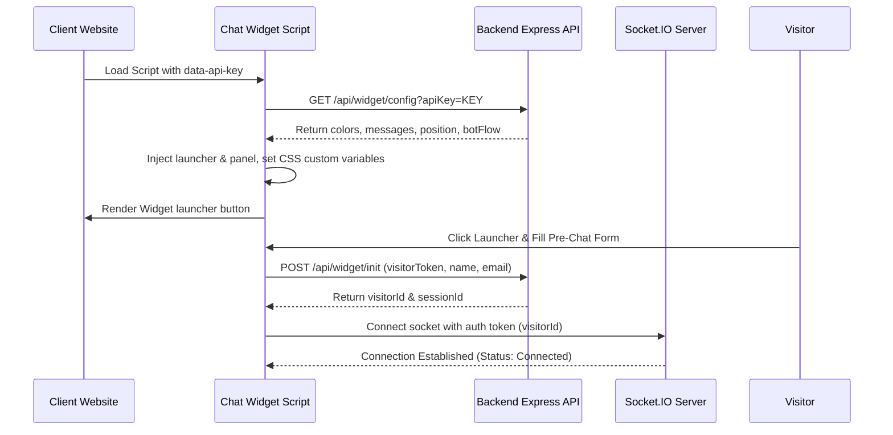

# Chat Widget Integration and Visual Customization

This document provides a comprehensive guide for integrating, initializing, custom-styling, and troubleshooting the client-side embeddable Chat Widget in JTS Chat Support.

---

## 1. Module Overview & Business Purpose

The **Chat Widget** is a client-side javascript application injected into external host websites. It serves as the primary customer-facing portal, providing:
-   **Pre-Chat Onboarding**: Collects visitor contact details before initiating conversations.
-   **Interactive Flow Bot**: Resolves support cases using condition branches, button selections, dynamic inputs, and escalations.
-   **Live Messaging Stream**: Allows visitors to exchange text messages, emojis, and attachments with agents.
-   **Service Feedback Center**: Prompts visitors to rate their chat experience, automatically resetting sessions afterwards.

---

## 2. Widget Architecture & Lifecycle

### 2.1 Technical Architecture
The widget is compiled into a single IIFE Javascript bundle (`chat-widget.js`) that:
1.  Locates its parent script tag to read integration parameters (`data-api-key`, `data-api-url`).
2.  Creates and appends CSS styling elements (`style.css`) and DOM nodes (`csw-launcher` and `csw-panel`) directly into the parent document.
3.  Establishes a real-time event pipeline using `socket.io-client`.



### 2.2 Session Lifecycle Stages
1.  **Boot Configuration**: Fetches website branding rules and flow parameters from the database Website record.
2.  **Branding Injection**: Sets theme styling via CSS custom variables (`--csw-primary` and `--csw-accent`).
3.  **Pre-Chat Stage**: Displays the welcome message and validation inputs to collect the visitor's name and email.
4.  **Bot Flow Execution**: Runs the interactive flow bot. Visitors select quick reply options and submit dynamic forms.
5.  **Agent Conversation**: Connects to the Socket.IO stream if the bot escalates the chat or a live agent claims the session.
6.  **Resolution & Rating**: When the chat is marked resolved, the widget prompts the visitor to submit a feedback rating (1 to 5 stars).
7.  **Auto Reset**: Submitting feedback clears local storage keys and returns the widget to the pre-chat stage after a 2.5-second delay.

---

## 3. Navigation Path

*   **Host Site Integration**: Injected into the target site's HTML template via a script tag.
*   **Settings Controller**: `/client?tab=websites` (Admin and Client settings page).

---

## 4. User Roles & Required Permissions

*   **Public Visitors**: No authentication required.
*   **Integrators (Admins / Client Owners)**: Requires edit access to Website Settings to fetch embed script parameters.

---

## 5. Prerequisites

1.  **Valid Website Record**: The target domain name must be registered in the platform database.
2.  **API Key**: A valid website API Key must be supplied in the script tag attribute (`data-api-key`).
3.  **Active Port**: Port `5000` (or configured API domain) must accept incoming WebSocket connections.

---

## 6. Step-by-Step Instructions

### 6.1 Widget Installation
1.  Navigate to `/client?tab=websites`.
2.  Locate the target website card and click **Code Snippet** (or copy details during website setup).
3.  Copy the Javascript block:
    ```html
    <script>
      (function(){
        var s = document.createElement("script");
        s.src = "http://localhost:5000/chat-widget.js";
        s.setAttribute("data-api-key", "YOUR_WEBSITE_API_KEY");
        document.body.appendChild(s);
      })();
    </script>
    ```
4.  Paste the snippet into your website's HTML template before the closing `</body>` tag.

### 6.2 Engaging with the Widget
1.  Load the target website in a browser.
2.  Observe the floating chat launcher bubble (default: `💬`) in the bottom-right corner.
3.  Click the launcher to expand the panel.
4.  If the pre-chat form is active, enter your **Name** and **Email**, and click **Start Chat**.
5.  **Interacting with Bot Nodes**:
    -   Click the options buttons (quick replies) to navigate custom bot flows.
    -   Fill out custom forms (e.g. details, budget, requirements) when prompted.
6.  **Exchanging Messages**:
    -   Type messages in the bottom input bar.
    -   Click the emoji icon (😊) to expand the emoji grid and select characters.
    -   Click the clip icon (📎) to select and upload attachments.
7.  **Ending & Feedback Rating**:
    -   Click the Close button (✖) in the header or complete the bot flow to trigger the feedback screen.
    -   Select a star rating (1 to 5), add optional comments, and click **Submit**.
    -   After 2.5 seconds, the session resets and returns to the pre-chat stage.

---

## 7. Feature Details

### 7.1 Online / Offline Mode & Business Hours
The widget dynamically adjusts its state based on the website's configuration:
-   **Online Mode**: If agents are online and business hours are active, the widget loads the pre-chat form or flow bot.
-   **Offline Mode**: If the current time is outside configured business hours or no agents are available, the widget displays the **Away Message** and renders the offline ticketing form (`raise_ticket`).

### 7.2 Visual Customization
-   **Theme & Colors**: Visual styles (primary and accent colors) are configured in the Website dashboard and loaded dynamically via CSS variables:
    ```css
    --csw-primary: colors.primary;
    --csw-accent: colors.accent;
    ```
-   **Widget Position**: Renders in the bottom-left or bottom-right corner based on the website's position setting.

### 7.3 Message Thread & Attachments
-   **Emoji Picker**: Clicking the emoji icon (😊) opens a picker grid containing standard emojis. Clicking an emoji inserts it into the text input.
-   **File Attachments**: Clicking the paperclip icon (📎) opens the system file selector. Supported formats are images and PDFs up to **10MB**. Uploaded files display inline previews or download links.

---

## 8. Planned Features [Coming Soon]

The following widget features are not implemented and are scheduled for future releases:
-   **Custom Size Configuration**: The widget panel uses a static responsive width (`370px` on desktop).
-   **Company Logo Upload**: Only text headers and emojis are currently supported for header styling.
-   **Avatar Configuration**: Standard avatar configurations for support bots and agents are pending implementation.
-   **Auto Open Trigger**: The widget panel does not support automatic expansion based on delay timers.
-   **Sound Notifications**: Audible alerts for incoming messages are not supported.
-   **Multi-Language Translations**: The widget interface is currently locked to English.

---

## 9. Field & Button Reference

### 9.1 Widget UI Form Inputs
*   **Pre-Chat Name**: Full display name of the visitor.
*   **Pre-Chat Email**: Visitor's contact email.
*   **Input Message Field**: Standard text box for visitor messages (maximum length: 1000 characters).
*   **Feedback Comment Box**: Optional feedback comments box (maximum length: 500 characters).

### 9.2 Widget UI Action Buttons
*   **csw-launcher**: Floating action button that toggles the chat panel open and closed.
*   **csw-close-chat**: Header button (✖) used to end the current chat session.
*   **csw-emoji-btn**: Toggles the emoji selector grid.
*   **csw-attach-btn**: Triggers the system file selector (📎).
*   **csw-send**: Submits the text message to the Socket.IO stream.

---

## 10. Validation & Constraints

*   **Attachment Constraints**:
    -   *Max Size Limit*: **10MB** per file. Larger files are blocked.
    -   *Allowed MIME Types*: `image/jpeg`, `image/jpg`, `image/png`, `image/gif`, `image/webp`, and `application/pdf`.
*   **Pre-Chat Inputs**: Full Name and Email fields require validation before establishing the WebSocket connection.
*   **Domain Restrict Rules**: Request origin domains must match domain definitions in the database Website record to prevent spoofing.

---

## 11. Operational Flows

### 11.1 Success Flow (Pre-Chat Submission)
1.  Visitor submits name and email.
2.  The widget retrieves `visitorId` and `sessionId` values from `localStorage`, or requests new ones from `/api/widget/visitor`.
3.  The widget connects to the Socket.IO server:
    ```javascript
    const socket = io(API_BASE, { auth: { token: visitorId } });
    ```
4.  The panel switches to the active chat screen, and the status bar displays: **Connected**.

### 11.2 Failure Flow (Attachment Upload)
1.  Visitor attempts to upload an unsupported file type (e.g. `document.docx`).
2.  The widget checks the MIME type and blocks the upload.
3.  The status bar displays: "File type not supported. Only images and PDFs allowed."
4.  The input field is reset, and the status bar returns to "Connected" after 3 seconds.

---

## 12. API Reference & Database Relations

### 12.1 Widget REST APIs
*   `POST /api/widget/visitor` (Registers or fetches visitor profile IDs).
*   `POST /api/widget/upload` (Handles attachment uploads; requires header `x-api-key`).
*   `POST /api/widget/action` (Executes bot custom webhook callback scripts).
*   `POST /api/widget/feedback` (Submits star ratings and comment forms).

### 12.2 Models In Use
*   [Website Model](file:///backend/src/models/Website.js): Holds visual settings, custom stages, and integration properties.
*   [Visitor Model](file:///backend/src/models/Visitor.js): Tracks unique visitor identifiers.
*   [ChatSession Model](file:///backend/src/models/ChatSession.js): Holds conversation transcripts and active agents.

---

## 13. Business Rules

*   **Session Reset Velocity**: Submitting chat feedback triggers a session cleanup after 2.5 seconds, removing localStorage keys (`chat_support_visitor_...` and `chat_support_session_...`) to allow starting a fresh chat.
*   **Dynamic Custom Styling**: Colors are loaded dynamically from the database Website record and applied via CSS variables:
    ```css
    --csw-primary: colors.primary;
    --csw-accent: colors.accent;
    ```

---

## 14. Troubleshooting & FAQ

### Issue: Widget remains stuck on "Connecting to support..."
*   **Symptom**: The panel stays expanded but messages do not load.
*   **Resolution**:
    1.  Check the browser console for CORS errors. Ensure your domain is listed in the website settings.
    2.  Verify the backend server is running and accessible on port `5000`.
    3.  Confirm the `data-api-key` attribute matches the website's API key.

---

## 15. Best Practices

*   **Install Script Globally**: Include the widget script in a shared header template to allow continuous tracking across multiple pages.
*   **Validate Upload Formats**: Direct users to upload files as PNGs or PDFs to prevent upload rejections.

---

## 16. Screenshot & Video Checklists

### Screenshot 1: Active Chat Panel
*   **Screenshot Name**: `widget_active_panel.png`
*   **Page**: Target website index page
*   **Screen Location**: Bottom-right expanded panel.
*   **Why it is needed**: Displays message bubble layouts, agent indicators, and text entry fields.
*   **Annotation required**: Callout labels pointing to the status bar, conversation thread, attachment paperclip, and emoji button.
*   **Highlight areas**: Attachment button and the message input box.

### Video Walkthrough: Customer Experience Flow
*   **Recording Name**: `widget_customer_experience`
*   **Target Page**: External host website
*   **Actions to Record**: Click chat launcher bubble -> Enter name and email -> Submit pre-chat -> Select quick reply options -> Send text message -> Click Close -> Submit 5-star rating.
*   **Duration Limit**: Max 30 seconds.

---

## 17. Related Documentation

*   [Website Management and Scoping](file:///e:/Chat%20Support/Documentation/04_Website/01_website_management.md)
*   [Interactive Flow Builder Configurations](file:///e:/Chat%20Support/Documentation/12_Chat_Flow_Builder/01_flow_canvas.md)
*   [Live Chat Queue Operations](file:///e:/Chat%20Support/Documentation/10_Live_Chat/01_active_queue.md)
