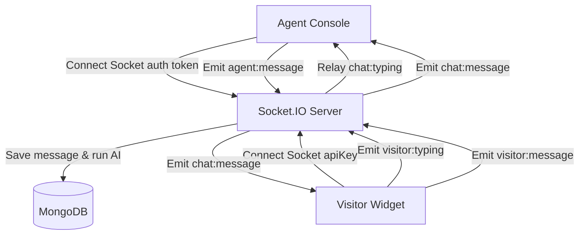

# Live Chat Desk & Conversation Queue

This document explains the real-time Live Chat workspace, Socket.IO event systems, conversation routing, queue balancing, typing indicators, and visitor details panels in JTS Chat Support.

---

## 1. Overview & Business Purpose

The **Live Chat Desk** provides agents, managers, and sales representatives with a real-time messaging console. 
-   **Conversation Routing** routes incoming visitor chats to online, available agents.
-   **Real-time Synchronization** uses Socket.IO to deliver instant messages, typing indicators, read receipts, and visitor presence logs.
-   **Visitor Profiles** display IP addresses, browser details, navigation history, and AI sentiment scores to help agents resolve cases faster.
-   **Collaboration Tools** allow agents to log private internal notes and transfer chats between departments.

---

## 2. Technical Architecture & Socket Events

The messaging network operates on a Socket.IO connection on port `5000` (synced via Express session cookies or Bearer JWT tokens):



### Core Socket Events

| Event Name | Sender | Receiver | Payload / Purpose |
| :--- | :---: | :---: | :--- |
| `visitor:join-room` | Visitor | Server | Registers the visitor socket to their specific `sessionId` room. |
| `agent:join-session` | Agent | Server | Registers the agent socket to a session room, updating viewer presence. |
| `visitor:typing` | Visitor | Server | Emits `{ isTyping: true/false }` to the session room. |
| `agent:typing` | Agent | Server | Emits typing state, `agentId`, and `agentName` to the visitor. |
| `chat:typing` | Server | Both | Relays typing states (`sender: "visitor"` or `sender: "agent"`). |
| `visitor:message` | Visitor | Server | Submits visitor message text, attachment URLs, and temporary client IDs. |
| `agent:message` | Agent | Server | Submits agent message text and attachment URLs. |
| `chat:message` | Server | Both | Relays the saved message payload containing timestamps and IDs. |
| `visitor:status` | Server | Agent | Emits online status updates when a visitor disconnects or reconnects. |

---

## 3. Navigation Path

*   **Agent Queue Workspace**: `/agent?tab=chats` (Renders active queues, message streams, canned responses, and visitor info drawers).
*   **Admins/Managers Supervision**: `/client?tab=chats` or `/admin?tab=chats` (Renders global queues, reassignments, and history logs).

---

## 4. User Roles & Required Permissions

*   **Support Agents (`agent`), Sales (`sales`), Managers (`manager`), Client Owners (`client`), and Admins (`admin`)**: Access to view queues.
*   **Permissions**:
    -   *Read Chats*: Enforced using `/api/chats/sessions` API checks.
    -   *Manage Chats*: Action triggers (accept, close, transfer) require `CHAT_VIEW` and `CHAT_TRANSFER` permissions.

---

## 5. Prerequisites

1.  **Desk Availability**: The user's status must be toggled to **Available** (`isAvailable: true`) on `/agent?tab=settings` to receive automatic chat routing.
2.  **Website Scope**: The agent must be assigned to the website domain in the database to view its chat sessions.

---

## 6. Step-by-Step Instructions

### 6.1 Claiming and Replying to a Queued Chat
1.  Navigate to the Active Queue screen (`/agent?tab=chats`).
2.  In the **Unassigned Queue** column, select a waiting chat.
3.  Click **Claim Session**. The chat will move to your **My Active Chats** column.
4.  Type your message in the bottom input bar.
5.  To use a canned response: Type `/` followed by a shortcut keyword (e.g. `/hello`), select the response, and press Enter.
6.  Click the send icon or press Enter.

### 6.2 Transferring a Chat
If a conversation requires technical support or billing assistance:
1.  Click the **Transfer Chat** button in the chat details header.
2.  Select the destination **Department** (e.g. Technical Support) or a specific **Agent**.
3.  Click **Confirm Transfer**. The chat will route to the target queue, and a notification will alert the recipient.

### 6.3 Logging Private Notes
1.  In the chat input area, toggle the **Internal Note** switch (changing the text field border to yellow).
2.  Type your note (e.g. "Customer wants a quote for Standard plan").
3.  Click **Add Note**. The note will display inline with a yellow background and is hidden from the visitor.

### 6.4 Closing a Chat Session
1.  Once resolved, click **Close Session** in the chat drawer header.
2.  The chat will move to the **Closed Sessions** column, and the visitor will be prompted to submit a feedback rating.

---

## 7. Field & Button Reference

### 7.1 Queue Sidebar Columns
*   **Unassigned Queue**: Fresh visitor sessions waiting for an agent.
*   **My Active Chats**: Live sessions currently assigned to you.
*   **Closed Sessions**: Past resolved sessions.

### 7.2 Interface Actions
*   **Claim Session**: Sets `assignedAgent = current_user_id` and status to `active`.
*   **Close Session**: Updates status to `closed`, logging the closure timestamp.
*   **Transfer Chat**: Opens the transfer modal.
*   **Canned Responses Menu**: Opens the canned shortcuts list.

---

## 8. Validation & Constraints

*   **Active Chat Limit**: An agent can handle a maximum of **5 active sessions** concurrently:
    ```javascript
    const activeCount = await ChatSession.countDocuments({ assignedAgent: userId, status: "active" });
    if (activeCount >= 5) {
      // Automatic queue allocation will bypass this agent
    }
    ```
*   **Attachment Limits**: Files uploaded through the agent dashboard use standard Express storage limits (maximum size: **10MB**).

---

## 9. Operational Flows

### 9.1 Success Flow (Auto-Queue Allocation)
1.  A visitor submits the pre-chat form.
2.  A new session is created with `status: "queued"`.
3.  The automated queue processor checks for available agents:
    ```javascript
    const agent = await findAvailableAgent({ managerId, websiteId });
    ```
4.  If an agent is online, available, and has fewer than 5 active chats, the session is assigned to them automatically.
5.  The session status updates to `active`, the agent receives a notification, and the chat appears in their queue.

### 9.2 Failure Flow (Limit Overrun Block)
1.  An agent attempts to manually claim a sixth chat while already handling 5 active sessions.
2.  The backend checks the agent's active session count.
3.  The request is rejected, returning a `400 Bad Request` error:
    ```json
    {
      "status": "error",
      "message": "You can only handle up to 5 active visitors at a time."
    }
    ```
4.  The frontend displays the warning message in an alert container, blocking the manual claim.

---

## 10. API Reference & Database Relations

### 10.1 REST Endpoints
*   `GET /api/chats/sessions` (Lists active sessions for the current user).
*   `GET /api/chats/queued` (Lists queued sessions).
*   `PATCH /api/chats/sessions/:sessionId/accept` (Manually claims a session).
*   `POST /api/chats/sessions/:sessionId/transfer` (Transfers a session).
*   `POST /api/chats/sessions/:sessionId/notes` (Adds a private internal note).
*   `POST /api/chats/upload` (Handles attachments uploaded by agents).

### 10.2 Models In Use
*   [ChatSession Model](file:///backend/src/models/ChatSession.js): Stores session states, metrics, and assignments.
*   [Message Model](file:///backend/src/models/Message.js): Stores all messages and attachment URLs.
*   [User Model](file:///backend/src/models/User.js): Stores agent availability states and website assignments.

---

## 11. Security Considerations

*   **CORS Checks**: WebSocket handshakes verify the website's API key and domain.
*   **Scope Restrictions**: Non-admin users are restricted to viewing chats from their assigned website IDs, preventing cross-tenant data leaks.

---

## 12. Troubleshooting & FAQ

### Issue: "You can only handle up to 5 active visitors at a time."
*   **Probable Cause**: The agent has reached the maximum allowed active chats.
*   **Resolution**: Close completed chats in your active queue to free up capacity.

### Why am I not receiving incoming chats?
1.  Check your availability toggle settings. Ensure your status is set to **Online/Available**.
2.  Verify that your profile is assigned to the target website scope checkbox.

---

## 13. Best Practices

*   **Keep Queue Clean**: Close chat sessions promptly once issues are resolved to maintain accurate workload capacities.
*   **Use Canned Responses**: Set up canned shortcuts for common greetings and answers to reduce response times.

---

## 14. Screenshot & Video Checklists

### Screenshot 1: Live Chat Console
*   **Screenshot Name**: `chat_active_workspace.png`
*   **Page**: `/agent?tab=chats`
*   **Screen Location**: Active chat conversation thread.
*   **Why it is needed**: Displays message bubbles, sender labels, and the input console.
*   **Annotation required**: Callouts pointing to the claim button, typing indicator, emoji picker, attachment clip, and the internal note toggle.
*   **Highlight areas**: Internal note toggle.

### Video Walkthrough: Live Chat Engagement Flow
*   **Recording Name**: `chat_agent_engagement`
*   **Target Page**: `/agent?tab=chats`
*   **Actions to Record**: Select unassigned chat -> Click Claim -> Send text reply -> Toggle internal note -> Post note -> Select canned response -> Send shortcut -> Click Close.
*   **Duration Limit**: Max 30 seconds.

---

## 15. Related Documentation

*   [Website Management and Scoping](file:///e:/Chat%20Support/Documentation/04_Website/01_website_management.md)
*   [Chat Widget Integration](file:///e:/Chat%20Support/Documentation/05_Widget/01_chat_widget.md)
*   [Support Ticket Lifecycle](file:///e:/Chat%20Support/Documentation/14_Tickets/01_ticket_lifecycle.md)
