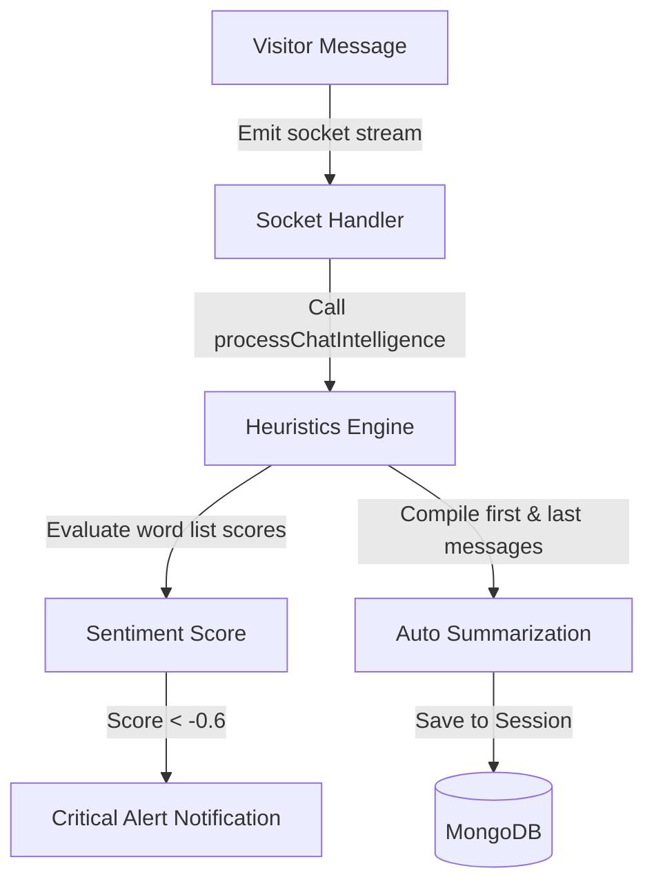

# Heuristics Intelligence Engine & CRM Analytics

This document details the rule-based Heuristics Intelligence Engine, sentiment scoring, supervisor alerts, Next Best Action (NBA) calculations, customer churn risk auditing, and database relations in JTS Chat Support.

---

## 1. Overview & Business Purpose

JTS Chat Support utilizes a local **Heuristics Intelligence Engine** that processes conversation details and CRM metrics in real-time. The engine:
*   **Scans Message Sentiment**: Checks visitor text against positive/negative word arrays, mapping scores from `-1` (Negative) to `1` (Positive).
*   **Triggers Critical Supervisor Alerts**: Automatically flags highly negative chats (score `< -0.6`) and notifies managers to intervene.
*   **Generates Conversation Summaries**: Compiles the first and last visitor replies to create conversation summaries.
*   **Calculates Next Best Actions (NBA)**: Recommends specific sales follow-ups based on pipeline stages and interaction dates.
*   **Computes Customer Churn Risks**: Audits interaction gaps and open ticket volumes to assign risk scores to customer accounts.

---

## 2. Technical Architecture & Rule Engine

The intelligence system executes local calculations automatically without calling external LLM endpoints:



### Core Heuristics Rules

1.  **Sentiment Scoring**: Scans visitor messages for positive words (`good`, `great`, `thanks`, etc.) and negative words (`bad`, `angry`, `broken`, etc.). The score is normalized between `-1` and `1` across all messages:
    *   *Positive Sentiment*: Normalized Score `> 0.2`
    *   *Neutral Sentiment*: Normalized Score `-0.2 to 0.2`
    *   *Negative Sentiment*: Normalized Score `< -0.2`
2.  **SLA Ticket Heat Score (0–100)**: Calculates SLA pressure for support tickets:
    *   *Base Weight*: `20` points.
    *   *Priority Additions*: Urgent = `+50`, High = `+30`, Medium = `+10`.
    *   *SLA Overdue pressure*: Resolution breached = `+30`, Breaches in <2 hours = `+20`, Breaches in <8 hours = `+10`.
    *   *Status Tension*: Waiting status = `+5`.

---

## 3. Navigation Path

*   **Sentiment Indicators**: `/client?tab=chats` (Visible in active chat session details).
*   **Supervisor Notifications**: Header notification bell icon (Global Alert Drawer).
*   **Next Best Action Panel**: `/client?tab=crm` -> Click Customer card (Profile Details Drawer).

---

## 4. User Roles & Required Permissions

*   **Agents and Sales Reps**: View sentiment labels and Next Best Action recommendations in drawers.
*   **Managers, Client Owners, and Admins**: Receive supervisor de-escalation alerts and view CRM reports.
*   **Permissions Required**: `CRM_VIEW` or `CHAT_VIEW` permissions.

---

## 5. Planned Capabilities [Coming Soon]

The following advanced LLM and machine learning capabilities are **Not Implemented**:
*   *OpenAI, Anthropic, or Google Gemini API Key Configurations*
*   *LLM Temperature and Max Tokens settings*
*   *System Prompt Personas*
*   *Vector Databases (Embedding searches, Pinecone, or PGVector integrations)*
*   *AI Auto-Replies and suggested replies*
*   *Prompts Template Versioning*
*   *Token Consumption cost graphs*

---

## 6. Step-by-Step Instructions

### 6.1 Reviewing Sentiment and Summary
1.  Navigate to the Active Chat Queue (`/client?tab=chats`).
2.  Select an active conversation.
3.  In the header, view the **Sentiment Indicator** badge (Neutral, Positive, or Negative).
4.  Open the chat details drawer to view the generated summary under **AI Summary**.

### 6.2 Managing Critical Supervisor Alerts
1.  If a visitor sends multiple negative messages, the sentiment score may fall below `-0.6`.
2.  The supervisor receives a notification: **Critical Sentiment Alert**.
3.  Click the notification link to open the active chat session.
4.  Review the message thread and take over the conversation if necessary.

### 6.3 Checking Next Best Actions (NBA)
1.  Go to the CRM dashboard `/client?tab=crm`.
2.  Select a lead card to open the profile drawer.
3.  Review the **Next Best Action** card:
    *   *Example*: "Proposal sent 3+ days ago. Call to check acceptance status."
4.  Complete the recommended task and log the activity to update the next action.

---

## 7. Next Best Action (NBA) Reference Matrix

The engine evaluates lead and ticket parameters to recommend the next action:

| Lead Stage / Condition | Recommended Action | Description | Priority |
| :--- | :--- | :--- | :---: |
| **New Lead** | Initial Outreach | New lead requires immediate contact. | High |
| **Contacted** (>2 days idle) | Nurture Lead | Send a follow-up email. | Medium |
| **Qualified** (No proposal) | Send Proposal | Draft and send the formal proposal. | High |
| **Proposal** (>3 days idle) | Review Proposal | Call to check proposal acceptance status. | High |
| **Negotiation** (>5 days idle)| Escalate Deal | Stalled negotiation. Suggest manager intervention. | High |
| **Customer** (>30 days idle) | Retention Check | Active customer. Perform a health check-in. | Medium |

---

## 8. Database Schema & Relations

### 8.1 ChatSession Sentiment Fields
*   **sentimentScore**: Calculated score decimal (`-1.00` to `1.00`).
*   **sentimentLabel**: Categories: `positive`, `neutral`, or `negative`.
*   **aiSummary**: Text summary compiled from the first and last messages.
*   **sentimentHistory**: Log array of up to **50 entries** tracking sentiment updates:
    ```javascript
    sentimentHistory: [{
      score: Number,
      label: String,
      timestamp: Date
    }]
    ```

### 8.2 Customer Intelligence Fields
*   **winProbability**: Expected conversion percentage (0-100%).
*   **churnRisk**: Churn likelihood (0-100%).
*   **nbaRecommendation**: Recommended next task.

---

## 9. Operational Flows

### 9.1 Success Flow (Supervisor Alert Trigger)
1.  A visitor sends negative messages (e.g. "terrible slow service, broken app").
2.  The heuristics engine processes the chat session.
3.  The sentiment score drops to `-0.8`.
4.  The system sends a notification to the manager:
    ```
    Customer sentiment is critical (negative, score: -0.80) on chat session X. Supervisor de-escalation recommended.
    ```

### 9.2 Failure Flow (Chat Empty)
1.  A visitor expands the widget launcher but disconnects before sending a message.
2.  The socket event trigger calls `processChatIntelligence`.
3.  The engine detects an empty message array and returns `null` without updating the database record.

---

## 10. Troubleshooting & FAQ

### Why is the AI Summary field empty?
*   **Probable Cause**: The visitor has not sent any messages, or the session has not been updated yet.
*   **Resolution**: Wait for the visitor to send their first message to allow the engine to process the summary.

### Why is the customer's churn risk set to 0%?
*   **Probable Cause**: The customer has interacted recently (within the last 30 days) and has fewer than 3 unresolved tickets.
*   **Resolution**: Churn risk calculations only apply to active customers who have gone unattended for over 30 days.

---

## 11. Best Practices

*   **Monitor Critical Alerts**: Assign supervisors to review critical alerts immediately to prevent customer churn.
*   **Follow NBA Recommendations**: Review lead drawers daily and follow Next Best Action recommendations to increase conversion rates.

---

## 12. Screenshot & Video Checklists

### Screenshot 1: Next Best Action Card
*   **Screenshot Name**: `crm_lead_nba_card.png`
*   **Page**: `/client?tab=crm` (Customer details drawer)
*   **Screen Location**: Next Best Action recommendation panel.
*   **Why it is needed**: Displays recommended actions, priority tags, and icons.
*   **Annotation required**: Callouts pointing to the action name, recommendation text, and priority badge.
*   **Highlight areas**: Recommendation panel.

### Video Walkthrough: Critical Sentiment Alert Flow
*   **Recording Name**: `intel_supervisor_alert`
*   **Target Page**: `/client?tab=chats`
*   **Actions to Record**: Send highly negative messages from the widget -> Observe supervisor dashboard notification banner -> Click alert link -> Open chat session.
*   **Duration Limit**: Max 30 seconds.

---

## 13. Related Documentation

*   [Live Chat Desk and Conversation Queue](file:///e:/Chat%20Support/Documentation/10_Live_Chat/01_live_chat.md)
*   [Customer Relationship Management and Pipelines](file:///e:/Chat%20Support/Documentation/13_CRM/01_crm_leads.md)
*   [Interactive Flow Builder Canvas](file:///e:/Chat%20Support/Documentation/12_Chat_Flow_Builder/01_flow_canvas.md)
