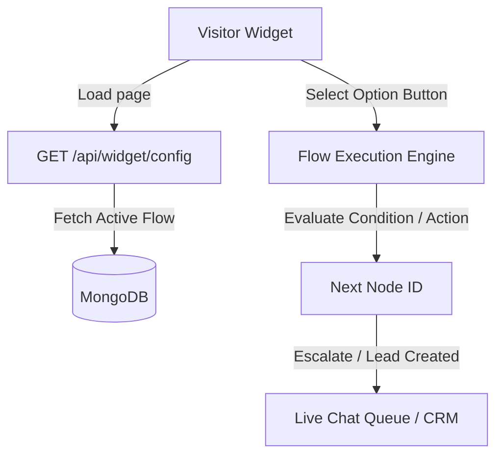

# Interactive Flow Builder & Decision Engine

This document describes the Flow Builder workspace, execution analytics, template presets, node types configuration, validation schemas, and database mappings in JTS Chat Support.

---

## 1. Overview & Business Purpose

The **Chat Flow Builder** allows client owners and administrators to design automated, interactive conversational menus for website visitors. The flow builder operates as a decision engine that:
1.  Greets visitors and presents quick-reply buttons.
2.  Guides users through dynamic data collection forms (leads, support tickets).
3.  Evaluates conditions (e.g. agent online availability status) to determine response paths.
4.  Escalates chats automatically to live support queues or external webhooks.
5.  Tracks clicks, conversion funnels, and node drop-off rates for performance auditing.

---

## 2. System Architecture & Flow Engine

The flow builder uses a structured node graph model saved as a key-value dictionary in MongoDB.

### 2.1 Technical Diagram

### 2.2 Execution Lifecycles & Version States
*   **Draft vs. Active (Published)**: The website profile links to an `activeFlowId`. Saving edits modifies the current flow schema. Activating a flow updates the website's pointer, deactivating other flows for that domain.
*   **Seeded States**: Registering a website automatically seeds a default flow containing:
    -   `root` welcome node.
    -   An escalation button option leading to a live support queue transfer.

---

## 3. Navigation Path

*   **Flow Canvas Drawer**: `/client?tab=websites` -> Click **Manage** on target website -> Select the **Dynamic Flow** (or Flow Builder) submenu.

---

## 4. User Roles & Required Permissions

*   **Read Access**: `client`, `admin`, `manager`, `sales`, and `accounts` roles (viewing active templates or flow structures).
*   **Write Access**: Restricted to Client Owners (`client`) and Global Administrators (`admin`).
*   **Permissions Required**: Administrative privileges are verified before committing flow mutations (`POST /api/flows` or `PATCH /api/flows/:id`).

---

## 5. Flow Builder Workspace & Canvas Design

### 5.1 Hierarchical Tree Form Canvas Interface
Unlike drag-and-drop node graph canvas editors, JTS Chat Support uses a **Sidebar List Tree + Form Configuration Interface**:
1.  **Left Sidebar (Tree Viewer)**: Lists all nodes in the flow dictionary (`root`, `node_...`). Nodes are color-coded and display icons indicating their node type.
2.  **Right Panel (Node Editor)**: Renders edit fields based on the selected node type (Text Area, Actions, Buttons lists, Form Fields list).

### 5.2 Planned Workspace Upgrades [Coming Soon]
The following visual canvas capabilities are **Not Implemented**:
*   *Drag-and-Drop Node Graph Blocks*
*   *Zoom, Pan, Mini Maps, Grids, and Snaps*
*   *Multi-node Selections*
*   *Copy, Paste, and Duplicate Node Blocks*
*   *Undo / Redo action queues*
*   *Keyboard Shortcuts*

---

## 6. Nodes Reference

Every node in JTS Chat Support is configured as an object inside the `nodes` dictionary.

### 6.1 Start Node / Root Node
*   **Purpose**: The entry point for the visitor widget conversation.
*   **Configuration**: Must be named `root` inside the database schema.
*   **Inputs**: Triggered when the visitor widget expands.
*   **Outputs**: Option buttons linking to child node IDs.
*   **Validation**: Must exist in the flow and must contain at least one option button.

### 6.2 Message Node
*   **Purpose**: Sends a text message to the visitor without requiring button input.
*   **Configuration**: Select `Message (Text)` type, edit the message text, and set the `next` target node ID.
*   **Validation**: Message text cannot be empty.

### 6.3 Button Group Node
*   **Purpose**: Renders multiple quick-reply options for visitors.
*   **Configuration**: Select `Button Group` type, enter the button labels, and set the target node ID (`next`) for each option.
*   **Validation**: Each option must have button text and point to a valid target node ID.

### 6.4 Form Node
*   **Purpose**: Renders a dynamic form to collect details (e.g. leads, ticket info) from visitors.
*   **Configuration**: 
    -   Click **+ Add Field** in the configuration panel.
    -   Set the field label (e.g. Full Name), variable name (e.g. `fullName`), type (Text, Textarea, Email, Number, Dropdown), and the required toggle.
    -   Define the `next` target node ID to navigate to after form submission.
*   **Runtime Behavior**: Validates inputs in the visitor widget before sending details to the server.

### 6.5 Action Node
*   **Purpose**: Runs backend tasks without requiring visitor interaction.
*   **Configuration**:
    -   *Escalate*: Connects the session to a live agent queue (can specify a target department).
    -   *Create CRM Lead*: Auto-prompts lead generation fields and converts the session into a CRM lead.
    -   *Create Support Ticket*: Auto-prompts ticket fields and creates a ticket.
    -   *Create Callback Request*: Logs a callback task in the dashboard.
*   **Runtime Behavior**: If a task fails (e.g. database timeout), the node falls back to live agent escalation.

### 6.6 Condition Node
*   **Purpose**: Branches the conversation based on system availability or schedules.
*   **Configuration**:
    -   *IF Agents are Online*: Checks if agents are online to determine the next path.
    -   *IF Business Hours Open*: Checks if the current time is within business hours.
    -   *THEN (True) Go To*: Target node ID if the condition matches.
    -   *ELSE (False) Go To*: Target node ID if the condition fails.

### 6.7 Planned Node Types [Coming Soon]
The following node types are **Not Implemented**:
*   *Media Nodes (Direct Image, Video, Audio, or File nodes)*
*   *Delay / Pause timers*
*   *AI prompt generation nodes / Knowledge base query nodes*
*   *Direct REST Webhook nodes*
*   *Direct SMS, WhatsApp, or Email trigger nodes*

---

## 7. Dynamic Flow Validation & Error Audits

The canvas runs real-time validation checks (`/api/flows/:id/validate`) to detect layout errors before saving:

| Error Code | Level | Description / Trigger |
| :--- | :---: | :--- |
| **MISSING_ROOT** | Error | No node named `root` exists in the flow dictionary. |
| **EMPTY_ROOT_OPTIONS** | Error | The `root` node exists but has no option buttons configured. |
| **BROKEN_LINK** | Error | An option button points to a node ID that does not exist. |
| **BROKEN_NEXT** | Error | A node's `next` field points to a node ID that does not exist. |
| **MISSING_ROOT_MESSAGE**| Warning| The `root` welcome message field is empty. |
| **CIRCULAR_REFERENCE** | Warning| A cycle is detected (e.g. `node_1` -> `node_2` -> `node_1`). |

---

## 8. Analytics & Funnel Auditing

The system tracks metrics by logging visitor events:
-   **visits**: Total times a node has been loaded by visitors.
-   **clicks**: Total clicks registered on specific button options.
-   **dropOffs**: Visitor sessions that ended on a specific node without reaching a resolution.
-   **Drop-Off Heatmap**: In the sidebar tree, nodes with high drop-off rates (>40%) are flagged in red. Low drop-off rates are marked in green.

---

## 9. API Reference & Database Relations

### 9.1 REST Endpoints
*   `GET /api/flows/website/:websiteId` (Lists flows for a website).
*   `POST /api/flows/` (Creates a new draft flow).
*   `PATCH /api/flows/:id` (Updates flow node parameters).
*   `POST /api/flows/:id/validate` (Runs structural validation checks).
*   `POST /api/flows/:id/activate` (Publishes a flow and links it to the website).
*   `GET /api/flows/:id/executive-summary` (Aggregates funnel conversions).
*   `GET /api/flows/:id/analytics` (Aggregates node visits and clicks).
*   `GET /api/flows/templates` (Retrieves flow templates).

### 9.2 Models In Use
*   [Flow Model](file:///backend/src/models/Flow.js): Stores flow node configurations.
*   [FlowTemplate Model](file:///backend/src/models/FlowTemplate.js): Stores preset flow templates.
*   [Website Model](file:///backend/src/models/Website.js): Linked via `activeFlowId` references.
*   [ChatSession Model](file:///backend/src/models/ChatSession.js): Tracks visitor metadata (`botMetadata.path`, `botMetadata.selections`, and `botStatus`).

---

## 10. Troubleshooting & FAQ

### Issue: "Cannot save flow — root node has no buttons"
*   **Probable Cause**: The root node options list is empty.
*   **Resolution**: Add at least one button to the root node to provide a path for visitors.

### Issue: "Circular reference detected" warning
*   **Probable Cause**: Nodes form a closed loop.
*   **Resolution**: Check your node connections to ensure the flow progresses towards a resolution node or agent escalation.

---

## 11. Best Practices

*   **Test Flows First**: Verify node connections using the validation drawer before publishing.
*   **Define Clear Resolutions**: Set options to lead to a resolution node (`isSolution`) or escalate to an agent to prevent visitor drop-offs.

---

## 12. Screenshot & Video Checklists

### Screenshot 1: Flow Builder Dashboard
*   **Screenshot Name**: `flow_builder_workspace.png`
*   **Page**: `/client?tab=websites` (Dynamic Flow drawer)
*   **Screen Location**: Central workspace panel.
*   **Why it is needed**: Displays the sidebar node list tree, active validation checks, and node settings.
*   **Annotation required**: Callouts pointing to the validation badge, node list tree, selected node type, and the action button list.
*   **Highlight areas**: Node settings configuration panel.

### Video Walkthrough: Flow Design and Publication
*   **Recording Name**: `flow_setup_publish`
*   **Target Page**: `/client?tab=websites` (Dynamic Flow drawer)
*   **Actions to Record**: Select root node -> Click Add Button -> Point button to new node -> Add text to new node -> Click Save -> Verify validation success.
*   **Duration Limit**: Max 30 seconds.

---

## 13. Related Documentation

*   [Website Management and Scoping](file:///e:/Chat%20Support/Documentation/04_Website/01_website_management.md)
*   [Chat Widget Integration](file:///e:/Chat%20Support/Documentation/05_Widget/01_chat_widget.md)
*   [Live Chat Queue Operations](file:///e:/Chat%20Support/Documentation/10_Live_Chat/01_live_chat.md)
