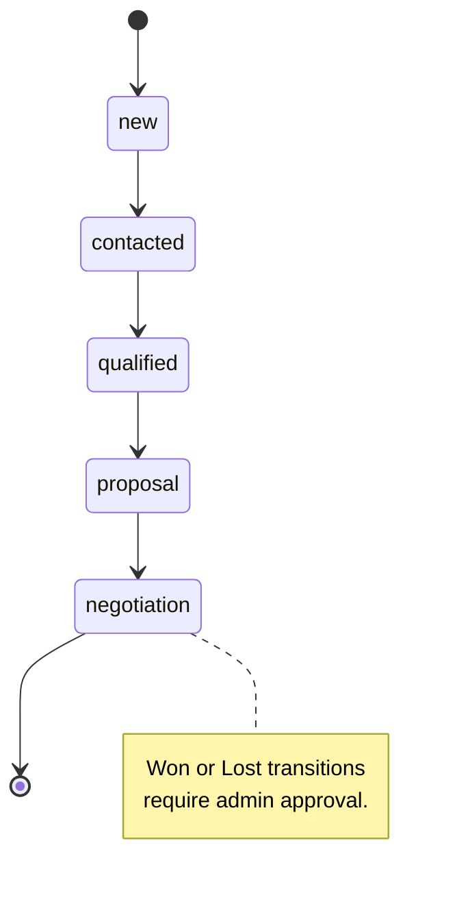

# Customer Relationship Management & Pipelines

This document provides a guide for managing customers, pipeline stages, quotations, billing invoices, and role-based access rules in the CRM module of JTS Chat Support.

---

## 1. Overview & Business Purpose

The **CRM Module** provides team members with a centralized console to manage leads, contacts, and opportunities.
*   **Kanban Board Pipeline**: Visualizes lead progress through custom pipeline stages.
*   **Role-Based Scope Filtering**: Displays leads to agents based on ownership, while allowing administrators and managers to view all records.
*   **Interactive Quotations**: Allows sales representatives to generate, approve, and email price quotes linked to Stripe checkout portals.
*   **Billing Invoicing**: Manages invoice items, generates client PDFs, and records payments.
*   **Duplicate Record Merging**: Consolidates duplicate profiles and notes to maintain data quality.

---

## 2. Navigation Paths

*   **CRM Workspace**: `/client?tab=crm` (Renders Board, Table, and Reports view).
*   **Accounts/Billing Workspace**: `/accounts?tab=crm` or `/accounts?tab=billing` (Renders invoice listings, quotation lists, and tax status parameters).

---

## 3. User Roles & Required Permissions

CRM visibility is scoped based on user roles and permissions:

*   **Sales Representative (`sales`)**: Scoped to view only their assigned leads (`ownerId = current_user_id`). Restricted from setting deal statuses to `won` or `lost`.
*   **Procurement Coordinator (`purchase`)**: Scoped to view only won deals (`pipelineStage = "won"`) to coordinate pricing and supplier activities.
*   **Client Owners & Admins (`client` / `admin`)**: Full workspace access to assign, merge, delete, and configure pipeline stages.
*   **Required Permissions**:
    -   *Read Leads*: `CRM_VIEW`.
    -   *Create Leads*: `CRM_CREATE`.
    -   *Merge Leads*: `CRM_MERGE`.
    -   *Delete Leads*: `CRM_DELETE`.

---

## 4. Prerequisites

1.  **Subscription Tier Verification**: The CRM features require standard or pro plan licenses (blocked on basic plan tier).
2.  **Website Configurations**: A website domain must be registered to associate incoming visitor leads.

---

## 5. Step-by-Step Instructions

### 5.1 Promoting a Live Chat Visitor to CRM
1.  Navigate to the Active Chat Queue (`/agent?tab=chats`).
2.  Click **Promote to CRM** in the conversation header.
3.  Enter the visitor's **Name**, **Email**, and **Company Name**.
4.  Click **Promote**. The system generates a Customer Reference Number (CRN) and adds the record to the CRM pipeline.

### 5.2 Managing Leads on the Kanban Board
1.  Navigate to the CRM dashboard `/client?tab=crm` and select the **Board View** tab.
2.  Drag lead cards between columns to update their pipeline stage.
3.  To update a stage manually, click the lead card to open the profile drawer, select a new stage from the dropdown, and save.
4.  *Note for Sales*: The system restricts sales reps from moving cards directly into **Won** or **Lost** columns.

### 5.3 Merging Duplicate Lead Records
1.  Open the CRM workspace table view `/client?tab=crm`.
2.  Locate duplicate entries (e.g. same email registered under different CRNs).
3.  Click **Merge Profiles**.
4.  Select the **Primary Record** (which retains fields) and the **Secondary Record** (which will be archived).
5.  Confirm the merge. The system moves all note histories to the primary record and archives the secondary record.

### 5.4 Creating and Sending a Sales Quotation
1.  Click a lead card to open the profile drawer.
2.  Select the **Quotations** tab and click **Create Quotation**.
3.  Add line items (Name, Unit Price, Quantity, Tax %).
4.  Click **Save Quotation** to create a draft.
5.  Click **Request Approval** (for sales reps) or **Approve Quote** (for admins/managers).
6.  Click **Send Quote Email** to send a pricing link to the customer.

---

## 6. Field & Button Reference

### 6.1 Lead Profile Fields
*   **Customer Reference Number (CRN)**: Auto-generated unique identifier (e.g. `CRN-2026-XXXX`).
*   **Record Type**: Enum options: `lead`, `deal`, or `customer`.
*   **Lead Status**: Enum options: `new`, `contacted`, `qualified`, `disqualified`.
*   **Deal Stage**: Enum options: `qualified`, `proposal`, `negotiation`, `won`, `lost`.
*   **Pipeline Stage**: Enum options: `new`, `contacted`, `qualified`, `proposal`, `negotiation`, `won`, `lost`.
*   **Lost Reason**: Mandatory if the stage is set to `lost`. Enum options: `price_issue`, `competitor`, `no_response`, `not_interested`.
*   **Expected Close Date**: Falls back to `current_date + 30 days` if left blank for deals.

### 6.2 Interface Action Triggers
*   **Promote**: Promotes a visitor to the CRM.
*   **Merge Profiles**: Launches the duplicate resolution modal.
*   **Stage Editor**: Opens the pipeline custom stages editor.

---

## 7. Business Rules & Validation Details

### 7.1 Database Indexing Rules
To prevent duplicate records within a website domain, compound indexes enforce uniqueness on:
*   `email` + `websiteId`
*   `phone` + `websiteId`
*   `companyName` + `websiteId`

### 7.2 Sales State Transition Matrix
Sales representatives are restricted to the following stage transitions to ensure lead quality:

### 7.3 Lost Status Constraint
If a deal is moved to a lost stage (`dealStage = "lost"` or `pipelineStage = "lost"`), the backend requires a valid `lostReason` field. If missing, the update request is rejected with a `400 Bad Request` error.

---

## 8. Operational Flows

### 8.1 Success Flow (Quotation Payment)
1.  A customer receives a quotation email containing a Stripe payment link.
2.  The customer clicks the link and completes the payment on Stripe's checkout page.
3.  Stripe sends a webhook notification to the backend.
4.  The quotation status updates to `paid`, the lead status updates to `won`, and the record is assigned to the purchase coordinator queue.

### 8.2 Failure Flow (Invalid State Transition)
1.  A sales representative attempts to move a lead from `new` directly to `proposal` in the UI.
2.  The backend validates the change against `SALES_ALLOWED_STATUS_TRANSITIONS`.
3.  The request is rejected, returning a `403 Forbidden` error.
4.  The frontend displays a transition error message and returns the lead card to its previous column.

---

## 9. API Reference & Database Relations

### 9.1 REST Endpoints
*   `GET /api/crm` (Lists customers, scoped by role).
*   `POST /api/crm` (Creates a new customer profile).
*   `POST /api/crm/merge` (Merges duplicate customer profiles).
*   `POST /api/crm/:id/notes` (Adds a note to a customer profile).
*   `POST /api/crm/quotations` (Creates a sales quotation).
*   `POST /api/crm/invoices` (Creates a billing invoice).

### 9.2 Models In Use
*   [Customer Model](file:///backend/src/models/Customer.js): Stores customer details, status histories, notes, and tasks.
*   [Website Model](file:///backend/src/models/Website.js): Stores custom pipeline stage configurations.
*   [Quotation Model](file:///backend/src/models/Quotation.js): Stores price quotes.
*   [Invoice Model](file:///backend/src/models/Invoice.js): Stores billing invoices.

---

## 10. Troubleshooting & FAQ

### Issue: "Lost reason is mandatory when deal is lost."
*   **Probable Cause**: The lead was moved to `lost` without selecting a lost reason.
*   **Resolution**: Select a lost reason (e.g. Price, Competitor) in the profile drawer before changing the stage to lost.

### Why can't I move a lead to "Won"?
*   **Probable Cause**: Users with the `sales` role cannot move leads to won.
*   **Resolution**: Request a manager or administrator to approve the quotation or update the lead status.

---

## 11. Best Practices

*   **Avoid Duplicates**: Search for existing profiles by email before creating a new customer.
*   **Document Lead Activities**: Log notes and schedule follow-up tasks in the profile drawer to maintain accurate interaction timelines.

---

## 12. Screenshot & Video Checklists

### Screenshot 1: Kanban Pipeline Board
*   **Screenshot Name**: `crm_kanban_board.png`
*   **Page**: `/client?tab=crm`
*   **Screen Location**: Central Board View grid.
*   **Why it is needed**: Displays lead cards arranged in columns by pipeline stage.
*   **Annotation required**: Callouts pointing to the stage columns, lead card fields, and search filters.
*   **Highlight areas**: Lead card details.

### Video Walkthrough: Lead Engagement Flow
*   **Recording Name**: `crm_lead_pipeline_flow`
*   **Target Page**: `/client?tab=crm`
*   **Actions to Record**: Select lead card -> Open details drawer -> Add note -> Create quotation -> Drag card to proposal column.
*   **Duration Limit**: Max 30 seconds.

---

## 13. Related Documentation

*   [Registration, Login, and Session Gateway](file:///e:/Chat%20Support/Documentation/02_Account/01_registration_login.md)
*   [Live Chat Queue Operations](file:///e:/Chat%20Support/Documentation/10_Live_Chat/01_live_chat.md)
*   [Outbound SMTP Server Setup](file:///e:/Chat%20Support/Documentation/18_Settings/01_system_configurations.md)
