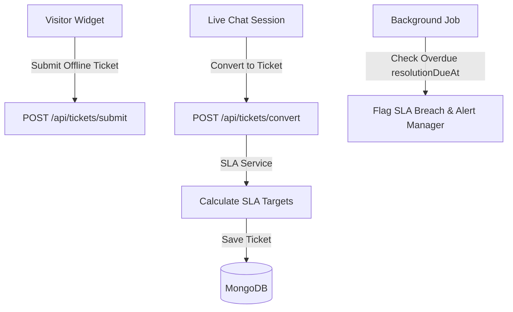

# Support Ticket Lifecycle & SLA Policies

This document explains how to create, convert, assign, and manage support tickets, track SLA targets, log public and private replies, and monitor automated escalations in JTS Chat Support.

---

## 1. Overview & Business Purpose

The **Ticketing Module** manages offline requests and escalations from live chat.
*   **Direct Widget Conversions**: Supports converting active live chat sessions into trackable support tickets.
*   **Public Status Tracking**: Generates unauthenticated tracking links for visitors to view ticket status updates.
*   **SLA Compliance Manager**: Dynamically calculates response and resolution due dates based on priority levels.
*   **Background Escalation Engine**: Automatically flags overdue tickets, increments escalation levels, and sends alerts to agents and managers.

---

## 2. Technical Architecture & Calculations



### SLA Target Calculation Rules
The platform calculates SLA targets from the creation timestamp based on priority levels:

| Priority Level | First Response Target | Full Resolution Target |
| :--- | :---: | :---: |
| **Urgent** | Within **15 Minutes** (0.25h) | Within **2 Hours** |
| **High** | Within **1 Hour** | Within **8 Hours** |
| **Medium** (Default) | Within **2 Hours** | Within **24 Hours** |
| **Low** | Within **4 Hours** | Within **48 Hours** |

---

## 3. Navigation Paths

*   **Support Desk Console**: `/client?tab=tickets` or `/agent?tab=tickets` (Renders active ticket tables, priority queues, SLA warnings, and comment panels).
*   **Public Tracking Interface**: `/public/:ticketId` (Allows unauthenticated visitors to track progress using a secure `shareToken`).

---

## 4. User Roles & Required Permissions

*   **Agents, Sales Reps, Managers, and Admins**: Access to view tickets.
*   **Action Permissions**:
    -   *Read Tickets*: Checked via `/api/tickets/` endpoint.
    -   *Create/Convert Tickets*: `TICKET_CREATE`.
    -   *Bulk Status Update*: `TICKET_UPDATE`.
    -   *Delete Tickets*: Restricted to `client`, `admin`, and `manager` roles.

---

## 5. Step-by-Step Instructions

### 5.1 Converting a Live Chat to a Support Ticket
1.  In the active chat console (`/agent?tab=chats`), click **Convert to Ticket** in the sidebar.
2.  Enter the ticket **Subject** and select a **Category** (e.g. Technical Support, Billing).
3.  Click **Submit**.
4.  The system:
    -   Generates a unique `ticketId`.
    -   Creates a ticket card in the visitor's chat window with a public tracking link.
    -   Links the chat transcript history to the ticket record.

### 5.2 Creating a Support Ticket Manually
1.  Navigate to the Tickets dashboard.
2.  Click **Create Ticket**.
3.  Enter the customer's **CRN** or email, a descriptive **Subject**, select the **Priority** (Low, Medium, High, Urgent), and set the **Department**.
4.  Type the initial issue details and click **Create**. The SLA engine automatically calculates target due dates based on the selected priority.

### 5.3 Replying and Adding Private Internal Notes
1.  Select a ticket from the Tickets table.
2.  Locate the reply panel.
3.  **To send a public update**: Type your message and click **Post Public Reply**. The visitor can see this update on their public tracking page.
4.  **To add a private note**: Toggle the **Internal Note** switch (changing the background border to yellow), type your note, and click **Post Note**. This note is hidden from the public tracking page.

### 5.4 Processing Resolved & Closed Statuses
1.  Once resolved, change the ticket status dropdown to **Resolved**. The resolver timestamp is saved.
2.  If the customer has no further questions, change the status to **Closed** to complete the lifecycle.

---

## 6. Field & Button Reference

### 6.1 Ticket Schema Reference
*   **ticketId**: Auto-generated unique identifier (e.g. `TKT-2026-XXXX`).
*   **status**: Ticket lifecycle state: `open`, `in_progress`, `waiting` (customer reply), `resolved`, `closed`, `pending`, `archived`.
*   **priority**: SLA calculator impact: `low`, `medium`, `high`, `urgent`.
*   **escalationLevel**: Number of times the ticket has breached its resolution SLA (defaults to `0`).
*   **firstResponseDueAt**: Target timestamp for the agent's first response.
*   **resolutionDueAt**: Target timestamp to resolve the ticket.
*   **slaBreachedAt**: Logged timestamp if the resolution target is missed.

### 6.2 Action Triggers
*   **Convert to Ticket**: Converts a chat session into a support ticket.
*   **Post Public Reply**: Submits a reply visible to the customer.
*   **Post Note (Internal)**: Saves a private note visible only to agents.

---

## 7. Automated Background Escalations

A background process runs periodically to check compliance:
```javascript
const staleTickets = await Ticket.find({
  status: { $nin: ["resolved", "closed", "archived"] },
  resolutionDueAt: { $lte: new Date() },
  slaBreachedAt: null
});
```
When a breach is detected, the system automatically:
1.  Sets `slaBreachedAt = current_timestamp`.
2.  Increments the `escalationLevel` by 1.
3.  Changes the status to `waiting` if it was set to `open`.
4.  Sends an `sla_breach` notification to the assigned agent.
5.  Sends an escalation notification to the tenant client owner / manager.
6.  Logs a `sla_breached` activity event.

---

## 8. Operational Flows

### 8.1 Success Flow (Chat Conversion)
1.  An agent clicks Convert to Ticket on an active chat session.
2.  The backend verifies the session details, creates the ticket, and links the transcript history.
3.  The visitor widget receives the ticket tracking card containing the public status link.

### 8.2 Failure Flow (SLA Target Overrun)
1.  An urgent ticket is created but remains unassigned for more than 2 hours.
2.  The background escalation job runs and detects the breach.
3.  The ticket is flagged as breached, the escalation level is incremented, and notifications are sent to the agent and manager.

---

## 9. API Reference & Database Relations

### 9.1 REST Endpoints
*   `POST /api/tickets/submit` (Public visitor offline ticket submission).
*   `GET /api/tickets/public/:ticketId` (Public tracking page data).
*   `POST /api/tickets/convert` (Converts active chat to ticket).
*   `PATCH /api/tickets/:id` (Updates ticket properties, status, or priority).
*   `DELETE /api/tickets/:id` (Deletes a ticket; restricted to managers/admins).
*   `GET /api/tickets/:id/activity` (Retrieves audit activity logs).

### 9.2 Models In Use
*   [Ticket Model](file:///backend/src/models/Ticket.js): Stores ticket details, status, notes, SLA metrics, and assignments.
*   [ChatSession Model](file:///backend/src/models/ChatSession.js): Linked via converted chat references.
*   [Customer Model](file:///backend/src/models/Customer.js): Linked via customer reference IDs.

---

## 10. Troubleshooting & FAQ

### Issue: "Ticket SLA breached" notification received
*   **Probable Cause**: The ticket resolution time has exceeded its SLA target.
*   **Resolution**: Review the ticket details, reply to the customer, or transfer the ticket to a specialized agent to resolve it.

### Why is a customer unable to view their public ticket tracking page?
*   **Probable Cause**: The share token or ticket ID is invalid.
*   **Resolution**: Verify the URL matches the link sent in the widget tracking card. Ensure the ticket has not been deleted or archived by a manager.

---

## 11. Best Practices

*   **Use Internal Notes for Collaboration**: Add private internal notes to document progress before transferring a ticket to another department.
*   **Close Resolved Tickets**: Update ticket statuses to Resolved and Closed promptly to prevent unnecessary SLA breach alerts.

---

## 12. Screenshot & Video Checklists

### Screenshot 1: Tickets Dashboard Queue
*   **Screenshot Name**: `ticket_dashboard_list.png`
*   **Page**: `/client?tab=tickets`
*   **Screen Location**: Active ticket table queue.
*   **Why it is needed**: Displays ticket lists, SLA indicators, status badges, and assigned agents.
*   **Annotation required**: Callouts pointing to the SLA status, Priority badge, and manual creation buttons.
*   **Highlight areas**: Priority badges and status indicators.

### Video Walkthrough: Chat to Ticket Conversion
*   **Recording Name**: `ticket_conversion_process`
*   **Target Page**: `/agent?tab=chats`
*   **Actions to Record**: Select active chat session -> Click Convert to Ticket -> Enter subject and category -> Submit -> Verify ticket tracking card appears in the chat stream.
*   **Duration Limit**: Max 30 seconds.

---

## 13. Related Documentation

*   [Live Chat Desk and Conversation Queue](file:///e:/Chat%20Support/Documentation/10_Live_Chat/01_live_chat.md)
*   [Customer Relationship Management and Pipelines](file:///e:/Chat%20Support/Documentation/13_CRM/01_crm_leads.md)
*   [Outbound SMTP Server Setup](file:///e:/Chat%20Support/Documentation/18_Settings/01_system_configurations.md)
