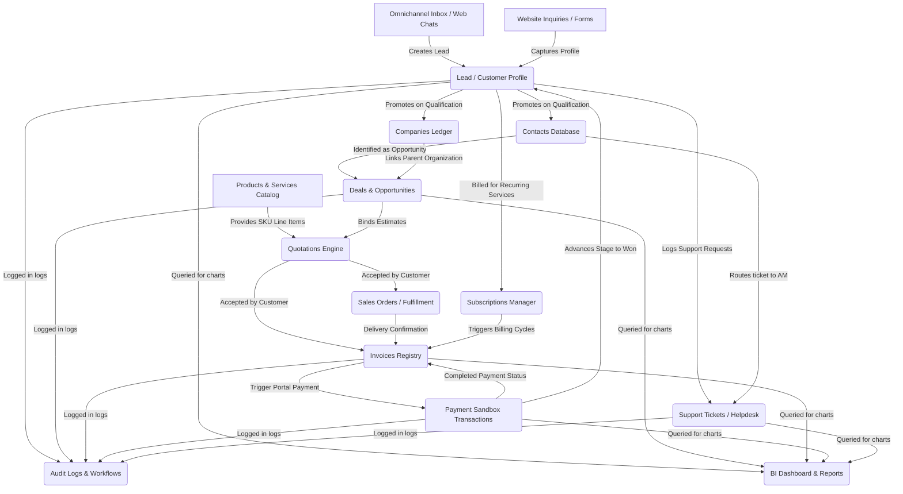

# JTS CRM System: Ultimate Functional Specifications & System Manual

This master manual serves as the single source of truth for the JTS CRM System. It contains the complete functional documentation, database schema rules, detailed step-by-step module workflows from creation to completion, user roles and permission grids, dependency charts, and the marketing-ready Feature Index.

---

## Part 1: Comprehensive CRM Modules Directory

### 1. Leads & Pipeline Management

#### 1.1 Core Specifications
*   **Module Name**: Leads & Pipeline Management
*   **Purpose**: To capture, track, nurture, and qualify early-stage business prospects.
*   **Business Use Case**: A customer fills a form on your website. A lead is auto-created. The sales agent calls the lead, logs notes, and qualifies them to a sales opportunity.
*   **Permissions**: `CRM_VIEW`, `CRM_CREATE`, `CRM_UPDATE`

#### 1.2 Screen-Wise Layout & Elements
*   **Kanban Board Screen**: Segregated into visual status columns. Displays lead cards with Name, Value, Owner, and Overdue task flags.
    *   *Buttons*: `New Lead`, `Import Leads`, `Export`, `Edit Stages`, `Board/List Toggle`.
    *   *Filters*: Owner dropdown, Website, Source.
    *   *Search*: Text box with fuzzy search by name/CRN.
*   **Lead Details Drawer**: Right slide-over panel.
    *   *Tabs*: Tickets, Chats, Email, Notes, Tasks, Quotes, Journey, Timeline, Audit Log.
    *   *Forms*: Edit Lead Form, Notes Input, Task Scheduler Form, Log Interaction Form.

#### 1.3 Record Workflow & Status Transitions
*   **Status Flow**: `New` ──> `Contacted` ──> `Qualified` ──> `Proposal` ──> `Negotiation` ──> `Won` / `Lost`.
*   **Approval Gates**: Moving a lead to `lost` requires filling out a mandatory "Lost Reason" text box. Transition to `Won` is auto-locked until a linked Quote is paid in full.
*   **Automation**: Assigns leads to online agents in a round-robin schedule. Emits websockets to alert the assignee.
*   **Validation Rules**: Email must be unique; phone must match international phone syntax (+country code).

#### 1.4 Communications & Timeline Chronicles
*   **Email**: Auto-dispatches a welcome introduction email once a lead is assigned.
*   **WhatsApp**: Launches WhatsApp Web via prefilled redirect: `https://api.whatsapp.com/send?phone={clean_phone}&text={url_encoded_text}`.
*   **SMS**: Sends text updates on status changes.
*   **Activity Timeline**: Tracks real-time chat histories, page views, quote updates, and notes.
*   **Notes**: Saves internal notes with `authorId` and timestamp.
*   **Attachments**: Saves files in `/uploads` static root and links them to the Customer document.
*   **Audit Logs**: Tracks change logs: `{ field: "pipelineStage", old: "new", new: "contacted", user: "agent_id" }`.
*   **Dependencies**: Linked to `Website` configuration.
*   **Reports**: Lead conversion ratios, lead growth charts.

---

### 2. Deals & Opportunity Management

#### 2.1 Core Specifications
*   **Module Name**: Deals & Opportunity Management
*   **Purpose**: To negotiate high-value deals and track pipeline value.
*   **Business Use Case**: A qualified customer requests a proposal for CCTV installation. A deal is logged, a quote is attached, and the expected closing date is tracked.
*   **Permissions**: `CRM_VIEW`, `CRM_UPDATE`

#### 2.2 Screen-Wise Layout & Elements
*   **Deals Grid Screen**: Grid displaying active opportunities, estimated value, win probabilities, and associated companies.
    *   *Buttons*: `Create Deal`, `Link Quotation`, `Export CSV`.
    *   *Filters*: Deal value range, Probability threshold.
    *   *Search*: Search by Deal Name or Customer Name.

#### 2.3 Workflow & Status Transitions
*   **Status Flow**: `Opportunity` ──> `Proposal Sent` ──> `Negotiation` ──> `Closed-Won` / `Closed-Lost`.
*   **Approval Gates**: Deals with discounts exceeding 15% require manager approval.
*   **Automation**: Automatically creates a pending Invoice once marked as Closed-Won.
*   **Validation Rules**: Estimated value must be positive; Expected close date must be in the future.

#### 2.4 Communications & Chronicles
*   **Email**: Automatic proposal PDF emails sent to stakeholders.
*   **Timeline & Notes**: Integrates all quotation history and negotiations under the Deal's central activity feed.
*   **Audit Logs**: Logs probability slider changes.

---

### 3. Contact & Company Directory

#### 3.1 Core Specifications
*   **Module Name**: Contact & Company Directory
*   **Purpose**: Centralized record of business contacts and corporate customer accounts.
*   **Business Use Case**: Accounts team looks up "Alliance Corp" to find all employee contacts, billing addresses, and VAT status.
*   **Permissions**: `CRM_VIEW`, `CRM_CREATE`, `CRM_UPDATE`

#### 3.2 Screen-Wise Layout & Elements
*   **Contacts Screen**: Grid of individual stakeholders.
*   **Companies Screen**: Ledger displaying VAT details, corporate trade licenses, and billing addresses.
    *   *Buttons*: `Create Contact`, `Create Company`, `Link Contact to Company`.
    *   *Filters*: Group type, Country.

#### 3.3 Workflow & Status Transitions
*   **Status Flow**: `Active` ──> `Suspended` ──> `Inactive`.
*   **Automation**: Mails are sent automatically if contact email domains match existing parent company records.
*   **Validation**: Trade license and VAT registration number formatting check.

#### 3.4 Chronicles & Logs
*   Timeline displays a consolidated stream of all activities from all individual contacts under the Company Profile page.

---

### 4. Calendar & Meeting Scheduler

#### 4.1 Core Specifications
*   **Module Name**: Calendar & Meeting Scheduler
*   **Purpose**: To coordinate customer calls, demos, and site meetings.
*   **Business Use Case**: A salesperson schedules a zoom demo with a client. The system creates a Zoom meeting and emails invitations.
*   **Permissions**: `CRM_MANAGE_TASKS`

#### 4.2 Screen-Wise Layout & Elements
*   **Calendar View Screen**: Monthly, weekly, or daily view grids plotting task deadlines and meetings.
    *   *Buttons*: `Create Meeting`, `Authorize Integrations`.
*   **Form**: Title, Date/Time, Participants (emails list), Platform (Zoom/Teams).

#### 4.3 Automations & Validations
*   *Automation*: Generates meetings and join URLs. Sends calendar `.ics` invites.
*   *Validation*: Blocks meetings from conflicting with existing slots.

---

### 5. Product Catalog & Inventory

#### 5.1 Core Specifications
*   **Module Name**: Product Catalog & Inventory
*   **Purpose**: To manage company items, SKUs, and service prices.
*   **Permissions**: `CRM_VIEW`, `CRM_UPDATE`
*   **Forms**: Product Form (SKU, Price, VAT percentage, Unit Type).

---

### 6. Quotations & Estimates

#### 6.1 Core Specifications
*   **Module Name**: Quotations & Estimates
*   **Purpose**: To compile proposal pricing and route high-value estimates for approval.
*   **Business Use Case**: Executive drafts a quote. Because it is AED 15,000, it requests Manager sign-off.
*   **Permissions**: `CRM_CREATE_QUOTE`, `CRM_VIEW`

#### 6.2 Screen-Wise Layout & Elements
*   **Workspace**: Dynamic line-item grid with autocomplete SKU lookup.
    *   *Buttons*: `Compose Quote`, `Submit for Review`, `Approve`, `Reject`, `Download PDF`.
    *   *Forms*: Quote Form (Client Name, Item list: Product, Qty, Unit Cost, VAT%, Discount%).

#### 6.3 Approval Gate Architecture
```
[Quote value < AED 10k] ──> Auto-Approved
[Quote value >= AED 10k] ──> Requires Sales Manager Approval
[Quote value >= AED 50k] ──> Requires Director Approval
```

#### 6.4 Automations & Validations
*   *Validation*: Discount percentage cannot exceed 20% without administrative override.
*   *Email*: Prefilled HTML template delivering PDF download link.

---

### 7. Sales Orders

#### 7.1 Core Specifications
*   **Module Name**: Sales Orders
*   **Purpose**: To coordinate order fulfillment.
*   **Status Flow**: `Draft` ──> `Confirmed` ──> `Processing` ──> `Shipped` ──> `Delivered` ──> `Cancelled`.
*   **Validation**: Waybill number required before marking status as `Shipped`.

---

### 8. Invoices & Payments

#### 8.1 Core Specifications
*   **Module Name**: Invoices & Payments
*   **Purpose**: Generating invoices, recording transactions, and processing payments.
*   **Permissions**: `PORTAL_PAY_ACCESS`, `FINANCE_VIEW`

#### 8.2 Screen-Wise Layout & Elements
*   **Invoices Screen**: Lists outstanding ledger balances.
*   **Checkout Screen**: Client portal sandbox interface for entering credit cards.
    *   *Buttons*: `Confirm & Pay`, `Download PDF`, `Send Reminder`.
    *   *Form*: Card Checkout Details (Method, Amount, Reference).

#### 8.3 Validation & Status Flow
*   **Strict Status Enum**: Payment transaction records must map to: `["pending", "completed", "failed", "refunded"]`. The status `"success"` is blocked.
*   **Post-Payment Trigger**: When payment status is `"completed"`, backend updates the invoice state to `"paid"` and customer's stage to `"won"`.

---

### 9. Subscriptions & Billing

#### 9.1 Core Specifications
*   **Module Name**: Subscriptions & Billing
*   **Purpose**: Automated quarterly and annual renewals.
*   **Billing Intervals**: `monthly`, `quarterly` (+3M), `half_yearly` (+6M), `yearly` (+12M).
*   **Daily Cron Automation (8:00 AM)**:
    *   Queries active subscriptions ending in exactly 3 days.
    *   If `autoRenewal` is true: Generates renewal invoice.
    *   If `autoRenewal` is false: Dispatches warning renewal alert email.

---

### 10. Helpdesk & Support Tickets

#### 10.1 Core Specifications
*   **Module Name**: Helpdesk & Support Tickets
*   **Purpose**: Managing client tickets and SLAs.
*   **Form**: Subject, Category, Priority (low/medium/high/urgent), Description.
*   **Status Flow**: `Open` ──> `In Progress` ──> `Waiting` ──> `Resolved` ──> `Closed`.
*   **Auto-Assignment**: Tickets are automatically assigned to the customer's account owner (`assignedAgent = customer.ownerId`).

---

### 11. Omnichannel Inbox & Live Chats

#### 11.1 Core Specifications
*   **Module Name**: Omnichannel Inbox & Chats
*   **Purpose**: Real-time websocket-based messaging streams.
*   **Interactive Elements**: `Claim Chat`, `Insert Canned Reply`, `Transfer Chat`.

---

### 12. Workflows & Automations

#### 12.1 Core Specifications
*   **Module Name**: Workflows & Automations
*   **Purpose**: Triggering background operations and webhooks on database events.
*   **Status Flow**: `running` ──> `success` / `failed`.

---

## Part 2: User Roles & Permissions Matrix

This matrix specifies dashboard and CRUD limits for every system role.

| Role | Dashboard | Create | View | Edit | Delete | Export | Import | Approve | Assign | Reports | Settings |
| :--- | :--- | :--- | :--- | :--- | :--- | :--- | :--- | :--- | :--- | :--- | :--- |
| **Super Admin** | Full | All | All | All | All | All | All | All | All | Full | Full |
| **Admin** | Full | All | All | All | Limited | All | All | All | All | Full | Full |
| **Manager** | Full | All | All | All | None | All | All | All | All | Full | Limited |
| **Sales Manager**| Sales | Leads, Deals | Leads, Deals | Leads, Deals | None | Leads | Leads | Quotes | Team | Sales | None |
| **Sales Exec** | Sales | Own Leads | Own Leads | Own Leads | None | None | None | None | None | Own | None |
| **Telecaller** | Lead | Leads | Leads | Leads | None | None | None | None | None | None | None |
| **Marketing** | Campaigns| Campaigns | Campaigns | Campaigns | None | Leads | Leads | None | None | ROI | None |
| **Support** | Helpdesk | Tickets | Tickets | Tickets | None | None | None | None | None | SLA | None |
| **Finance** | Finance | Invoices | Invoices | Invoices | None | Invoices | None | Payments| None | Tax | None |
| **HR** | HR | Employees | Employees | Employees | None | None | None | Leave | None | Staff | None |
| **Employee** | Personal | Tasks | Tasks | Own Tasks | None | None | None | None | None | None | None |
| **Customer** | Portal | Tickets | Own Data | Profile | None | Own PDF | None | Quotes | None | None | Portal |
| **Vendor** | Portal | RFQs | Own POs | Profile | None | None | None | RFQs | None | None | None |

---

## Part 3: Operational Rules and Data Flow Architecture

### 3.1 Visual Module Dependency Diagram



---

## Part 4: CRM System Feature Index

| Module | Feature | Description | User Roles | Workflow | Dependencies | Reports | Automation | Permission Required |
| :--- | :--- | :--- | :--- | :--- | :--- | :--- | :--- | :--- |
| **Leads & Pipeline** | Kanban Board View | Drag-and-drop column grid to visualize and qualify lead stages. | Super Admin, Admin, Manager, Sales Manager, Sales Exec, Telecaller | Drag cards to advance status. Opens detail drawer on click. | Customer schema, Website config | Lead stage conversion ratios | Auto-logs timeline changes | `CRM_VIEW`, `CRM_UPDATE` |
| **Omnichannel inbox** | Live Chat Widget | Real-time browser socket chat to communicate with visitors. | Support, Sales Exec, Managers, Admins | Visitor chats -> Agent claims session -> Sends canned replies. | Session & Message collections | Agent response times, session logs | Auto-assigns session; registers visitor email | `INBOX_ACCESS` |
| **Calendar & Events**| Meeting Scheduler | Calendar planner to schedule demos, Zoom links, and follow-ups. | All internal roles | Select date -> Input client email -> Select Zoom -> Sends invitations. | Meeting schemas, Zoom API integrations | Completed vs. pending follow-ups | Generates and emails join links | `CRM_MANAGE_TASKS` |
| **Quotations** | Estimate Builder | Itemized quotation builder with discount controls and automated VAT. | Admin, Manager, Sales Manager, Sales Exec | Rep creates quote -> Manager approves (if >10k) -> Sent to customer. | Product catalog, Customer profile | Quote acceptance rates, discount logs | Locks quote if budget limits are crossed | `CRM_CREATE_QUOTE` |
| **Invoices & Payments**| Portal Sandbox Checkout | Online card/UPI gateway simulator for paying invoices. | Customer, Finance, Admin | Invoice sent -> Customer clicks Pay -> Inputs card -> Invoice paid. | Invoice schema, Payment collection | Payment logs, outstanding balances | Auto-marks invoice paid and deal won | `PORTAL_PAY_ACCESS` |
| **Billing & Renewals** | Daily Expiry Cron | Daily cron service to handle quarter/annual contracts renewal. | Background process (System Run) | Cron runs daily at 8AM -> Identifies end dates -> Fires renew alert. | Subscription schema, Email service | Recurring revenue forecast | Checks end date 3 days prior; generates draft bill | `SYSTEM_ADMIN` |
| **Support Helpdesk** | Client Portal Tickets | Support ticket loggers to escalate and track resolution queues. | Customer, Support, Sales Manager | Client logs ticket -> Auto-assigned to account owner -> Agent responds. | Ticket collection, Customer database | SLA breach warnings, resolved ratios | Auto-routes ticket to customer's account owner | `SUPPORT_TICKET_WRITE` |
| **Workflows** | Visual Canvas Builder | Trigger-action workflow maps to automate repetitive tasks. | Super Admin, Admin, Manager | Admin maps trigger (e.g. Lead Won) -> Defines action (Send Email). | WorkflowExecution schemas | Workflow execution history logs | Auto-sends webhook alerts or tags profiles | `WORKFLOW_ADMIN` |
| **BI Analytics** | Financial Dashboards | Visual charts reporting pipeline status, wins, and invoice revenue. | Super Admin, Admin, Manager, Finance | Real-time calculations aggregate system documents into charts. | Invoice, Customer, Payment collections | Sales forecasts, cash flow metrics | Automatically compiles weekly PDF charts | `BI_REPORTS_VIEW` |
| **Audit Logs** | Security Audit Trail | Graphical log grid tracking user logins, lead stage modifications, and pricing updates. | Super Admin, Admin, Manager | Manager opens Audit Trail -> Selects filters -> Views row changes & metadata payload. | AuditLog collection | Event frequency logs, modification audits | Diff calculation computes pre/post update state changes | `AUDIT_VIEW` |
| **Integrations** | WhatsApp Cloud Webhook | Verification challenge verification and inbound message parser. | Background (System Run) | Meta dispatch message -> Webhook parses body -> Matches customer phone -> Logs timeline. | Customer database, socket server | Incoming WhatsApp messaging counts | Auto-registers new unknown contacts as CRM leads | `SYSTEM_ADMIN` |
| **System Admin** | Automated Backups | Cross-platform batch tool to run scheduled MongoDB database dumps. | Super Admin, Admin | Admin triggers batch utility -> Script queries environment variables -> Generates zip. | MONGODB_URI configs | Server database backups lists | Creates timestamped zip archives inside backups directory | `SYSTEM_ADMIN` |
