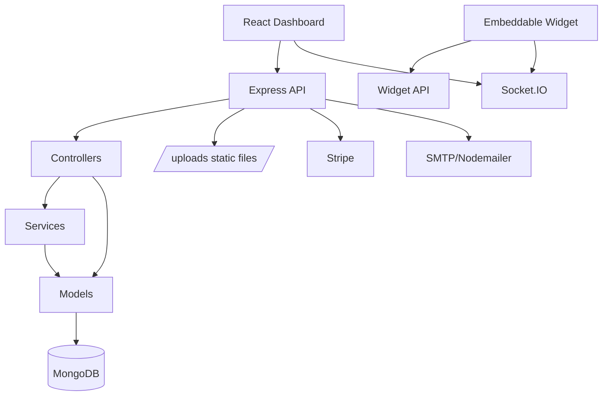
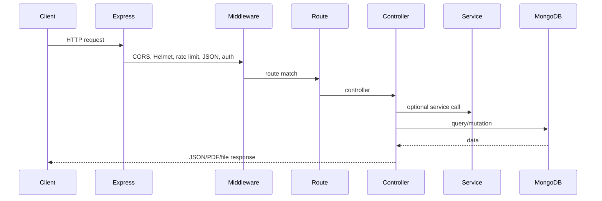
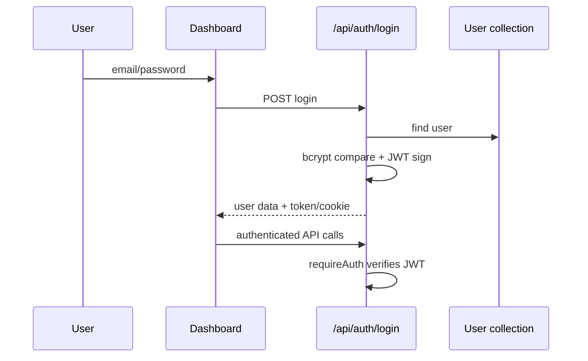
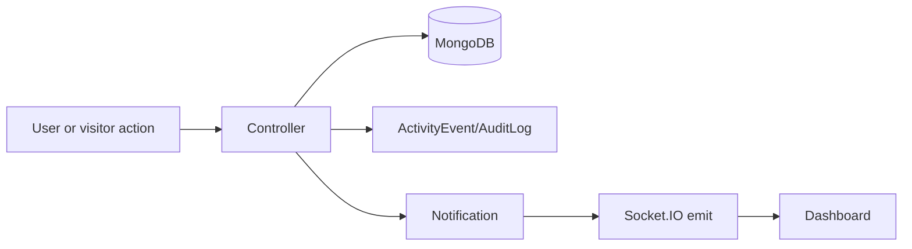
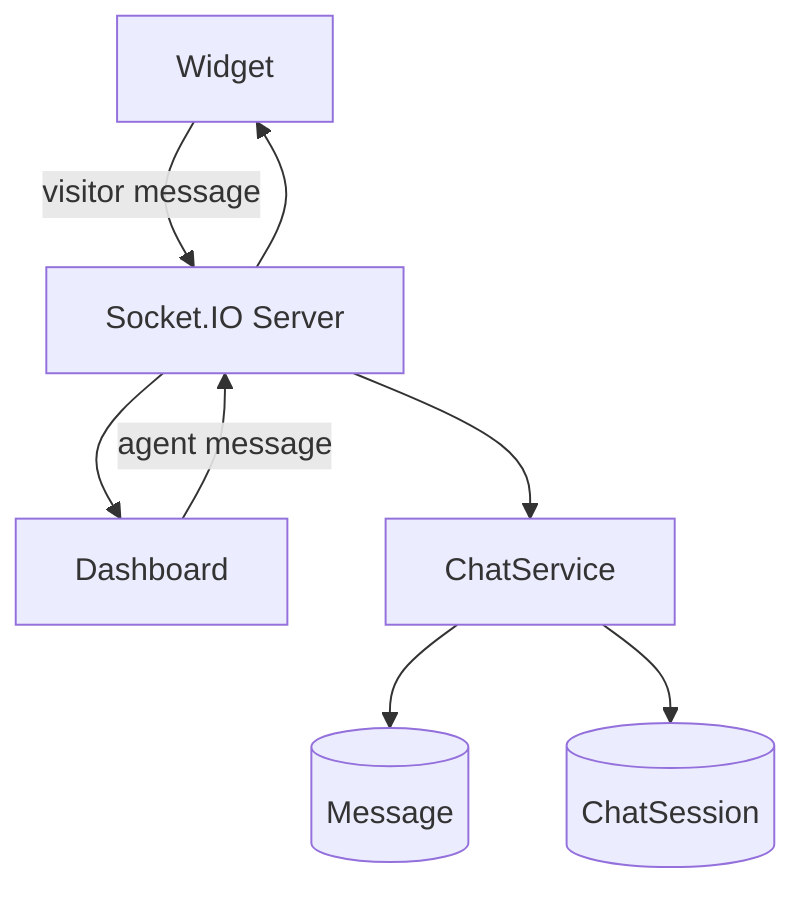
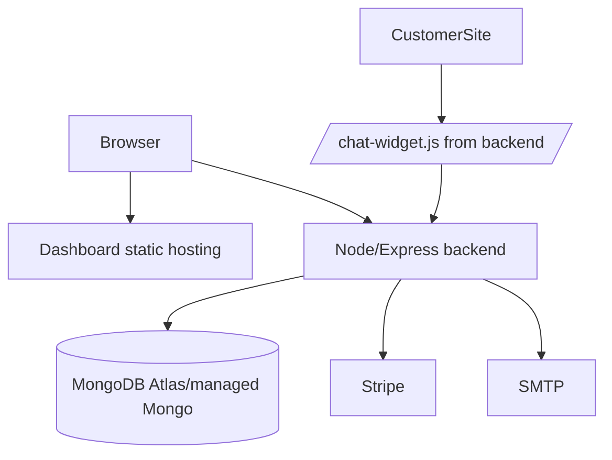

# Architecture

Related documents: [Project Overview](01_Project_Overview.md), [Database Documentation](03_Database_Documentation.md), [API Documentation](04_API_Documentation.md), [Deployment Guide](10_Deployment_Guide.md).

## Frontend Architecture

- `dashboard`: React 18 + Vite + React Router.
- Route-level lazy loading is used in `dashboard/src/App.jsx`.
- Shared contexts include auth, socket, currency, and toast.
- Components are module-oriented: CRM, tickets, chat, reports, inventory, procurement, security, billing, websites.
- API access is centralized in `dashboard/src/api/client.js`.

## Backend Architecture

- `backend`: Express 4 + MongoDB/Mongoose + Socket.IO.
- `src/app.js` registers CORS, Helmet, rate limits, raw Stripe webhook route, JSON parsing, static assets, API routes, and error middleware.
- Controllers are split by domain for CRM and tickets.
- Services cover automation, analytics, audit, assignment, chat, cron, email, intelligence, notifications, PDF, procurement, revenue, SLA, stock watching, and webhooks.

## Folder Structure

```text
backend/src
  app.js, server.js
  config/
  controllers/
  middleware/
  models/
  routes/
  services/
  sockets/
  utils/
dashboard/src
  api/
  components/
  constants/
  context/
  pages/
  styles/
  utils/
chat-widget/src
  main.js
  style.css
```

## Module Dependency



## Request Lifecycle



## Authentication Flow

Evidence: `backend/src/middleware/auth.js`, `backend/src/utils/jwt.js`.



Tokens are accepted from Authorization header, cookie, or query parameter. Query-token auth is a security concern; see [Security Audit](07_Security_Audit.md).

## Authorization Flow

- `requireRole(...roles)` checks normalized roles.
- `permissions.js` adds feature-level permissions for CRM actions.
- `getOwnedWebsiteIds` and `assertWebsiteAccess` support tenant/website scoping.
- Plan access uses `attachTenantSubscription` and `requirePlanFeature`.

Known issue: not every write path applies tenant scoping consistently.

## Event Flow



## Socket Flow

- `backend/src/sockets/index.js` configures Socket.IO.
- Dashboard uses `socket.io-client`.
- Widget uses `socket.io-client`.
- Chat sessions, messages, notifications, and live activity use socket events.



## Deployment Architecture

Evidence: `README.md`.

- Backend can deploy to Render or similar Node host.
- Dashboard can deploy to Vercel or static host.
- MongoDB is external via `MONGODB_URI`.
- Widget is built by `chat-widget` and copied to `backend/src/public/chat-widget.js`.



