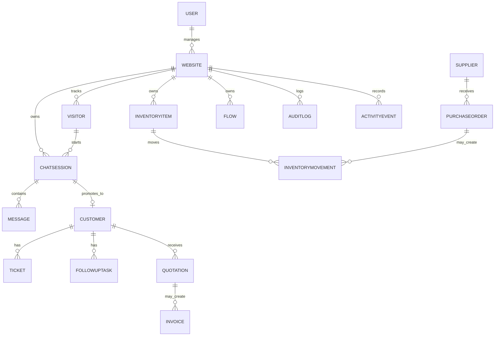

# Database Documentation

Related documents: [Architecture](02_Architecture.md), [API Documentation](04_API_Documentation.md), [Performance Audit](08_Performance_Audit.md).

Database engine: MongoDB via Mongoose. SQL tables and migrations are `NOT FOUND`.

## Collections

| Collection | Model | Purpose | Key Relationships |
|---|---|---|---|
| users | `User` | Auth, roles, subscriptions, assigned websites | `managerId -> User`, `websiteIds -> Website`, `supplierId -> Supplier` |
| websites | `Website` | Tenant website/widget configuration | `managerId -> User`, `activeFlowId -> Flow` |
| visitors | `Visitor` | Website visitor identity | `websiteId -> Website`, `customerId -> Customer` |
| chatsessions | `ChatSession` | Live/archived chat sessions | `websiteId`, `visitorId`, `customerId`, `assignedAgent` |
| messages | `Message` | Chat messages | `sessionId -> ChatSession`, `agentId -> User` |
| tickets | `Ticket` | Support tickets | `websiteId`, `visitorId`, `customerId`, `assignedAgent` |
| customers | `Customer` | CRM leads/customers/deals | `websiteId`, `ownerId`, `sessionId`, `ticketId` |
| followuptasks | `FollowUpTask` | CRM tasks/reminders | `customerId`, `websiteId`, `ownerId` |
| quotations | `Quotation` | CRM quotes | `customerId`, `websiteId`, `ownerId` |
| invoices | `Invoice` | CRM invoices | `customerId`, `quotationId`, `websiteId`, `ownerId` |
| suppliers | `Supplier` | Supplier companies | `websiteIds`, `createdBy` |
| purchaseorders | `PurchaseOrder` | Procurement orders | `supplierId`, `websiteId`, `items.itemId` |
| rfqs | `RFQ` | Requests for quotation | `websiteId`, `invitedSuppliers`, `bids.supplierId` |
| inventoryitems | `InventoryItem` | Stock catalog | `websiteId`, category/subcategory/size/color/supplier refs |
| inventorymovements | `InventoryMovement` | Stock movements | `websiteId`, `itemId`, `createdBy` |
| inventorycategories | `InventoryCategory` | Inventory category master | `websiteId` |
| inventorysubcategories | `InventorySubcategory` | Inventory subcategory master | `categoryId`, `websiteId` |
| sizes | `Size` | Inventory size master | `websiteId` |
| colors | `Color` | Inventory color master | `websiteId` |
| roles | `Role` | Dynamic roles/permissions | `createdBy -> User` |
| departments | `Department` | Support/ops departments | `websiteId`, `managerId` |
| categories | `Category` | Ticket/chat categories | `websiteId`, `managerId` |
| cannedresponses | `CannedResponse` | Saved replies | `managerId`, `tenantId` |
| notifications | `Notification` | In-app notifications | `userId`, related entity fields |
| auditlogs | `AuditLog` | Audit log records | `actorId`, `websiteId` |
| activityevents | `ActivityEvent` | Activity timeline | `actorId`, `websiteId`, entity type/id |
| analytics | `Analytics` | Website aggregate counters | `websiteId` |
| analyticssnapshots | `AnalyticsSnapshot` | Hourly analytics snapshots | `websiteId`, `hour` |
| flows | `Flow` | Widget flow builder definition | `websiteId` |
| flowtemplates | `FlowTemplate` | Reusable flow templates | none found |
| articles | `Article` | Knowledge-base articles | `categoryId`, `websiteId`, `authorId` |
| webhookdeliveries | `WebhookDelivery` | Webhook delivery history | `websiteId` |
| services | `Service` | Website service master | `websiteId`, `managerId` |

## Field Summary

Full field evidence is in `backend/src/models`. Important fields:

- `User`: `name`, `email`, `password`, `role`, `managerId`, `websiteIds`, `subscription`, `stripeCustomerId`, `stripeSubscriptionId`, `twoFactor*`, `supplierId`.
- `Website`: `websiteName`, `domain`, `apiKey`, `managerId`, widget colors/messages, feature toggles, business hours, webhooks, pipeline stages, `activeFlowId`, currency settings.
- `Customer`: `crn`, identity/contact fields, `recordType`, `leadStatus`, `dealStage`, `pipelineStage`, `status`, value/budget/probability fields, notes, communications, assignment/stage history, purchase workflow status, analytics fields.
- `Ticket`: `ticketId`, `websiteId`, `visitorId`, `customerId`, `assignedAgent`, `subject`, `priority`, `status`, `crmStage`, category/subcategory, SLA fields, notes, watchers, archive fields.
- `ChatSession`: `sessionId`, `websiteId`, `visitorId`, `customerId`, `status`, `assignedAgent`, satisfaction fields, archive fields, bot metadata, sentiment.
- `Quotation` / `Invoice`: generated IDs, `customerId`, `websiteId`, `ownerId`, `items`, totals, currency, status, PDF URL.
- `InventoryItem`: `websiteId`, `sku`, `name`, quantity/reorder/cost fields, category refs, supplier ref.
- `PurchaseOrder`: `poNumber`, `supplierId`, `websiteId`, items, total, status, history, reconciliation, `stockReceived`, `createdBy`.

## Indexes and Constraints

Evidence found:

- Unique `Website.apiKey`.
- Unique `User.email`.
- Unique `Customer.crn`.
- Customer compound indexes for email/phone/company by website and pipeline views.
- Unique `ChatSession.sessionId`.
- Unique `Visitor(visitorId, websiteId)`.
- Unique inventory masters by website/name.
- Unique `InventoryItem(websiteId, sku)`.
- Unique `AnalyticsSnapshot(websiteId, hour)`.
- Unique `Quotation.quotationId`, `Invoice.invoiceId`, `PurchaseOrder.poNumber`, `RFQ.rfqNumber`.

MongoDB foreign keys are not enforced; relationship integrity depends on controller/service logic.

## Entity Relationship Diagram

## Missing Indexes

Recommended indexes not found explicitly:

- `Message({ sessionId: 1, createdAt: 1 })`
- `ChatSession({ websiteId: 1, status: 1, assignedAgent: 1 })`
- `Ticket({ websiteId: 1, status: 1, assignedAgent: 1, createdAt: -1 })`
- `Notification({ userId: 1, read: 1, createdAt: -1 })`
- `PurchaseOrder({ websiteId: 1, status: 1, createdAt: -1 })`
- `RFQ({ websiteId: 1, status: 1, expiryDate: 1 })`
- `AuditLog({ websiteId: 1, createdAt: -1 })`

## Optimization Suggestions

- Add migrations or schema versioning.
- Add transaction handling for invoice workflow, PO stock receipt, customer merge, supplier plus user creation, and subscription mutations.
- Add retention policies for audit/activity/webhook deliveries.
- Encrypt or otherwise protect webhook secrets and 2FA secrets.
- Add pagination-friendly indexes for high-volume list endpoints.
