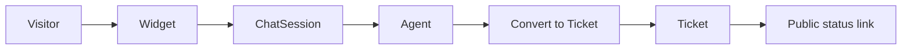
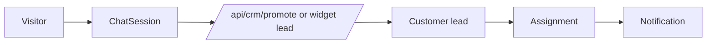
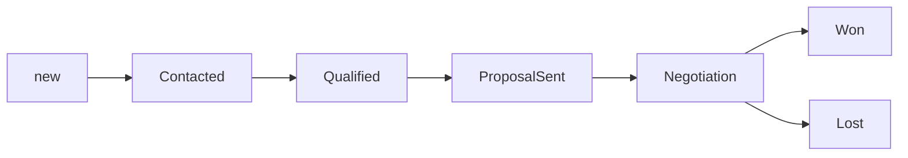
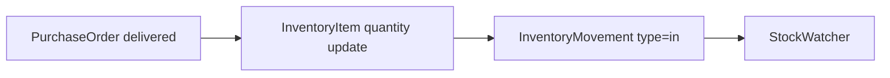
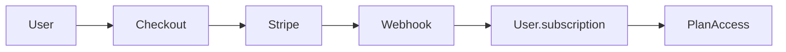

# Business Workflows

Related documents: [Feature Matrix](05_Feature_Matrix.md), [API Documentation](04_API_Documentation.md), [Database Documentation](03_Database_Documentation.md).

## Chat to Ticket

Status: implemented, partial production readiness. Evidence: widget routes, chat routes, ticket conversion controller, `TicketManager`.

## Visitor to CRM Lead

Status: implemented/partial. Duplicate detection and auto-assignment evidence exists in CRM utilities/services.

## Lead to Deal

Status: partial. CRM fields and board exist; lifecycle validation exists for several transitions.

## Deal to Quote

Flow: CRM customer -> quotation tab -> create quotation -> optional approval if total threshold requires it -> send/generate PDF.

Status: partial. Evidence: `crmQuotationController`, `CrmQuotationTab`, `Quotation`.

## Quote to Invoice

Status: partial. Invoices can reference `quotationId`, but a complete direct quote-to-invoice workflow is `NOT FOUND`.

## Invoice to Payment

Status: partial. Invoice status supports `pending`, `paid`, `void`; Stripe PaymentIntent is attached to quotations, not a complete invoice payment lifecycle. Payment reconciliation/webhook completion for invoices is `NOT FOUND`.

## Purchase to GRN

Status: partial. Dedicated GRN model is `NOT FOUND`. Purchase order `delivered` status triggers automatic stock receipt.

## GRN to Inventory

Status: partial without GRN entity. PO delivered -> inventory quantity increment -> `InventoryMovement` created.

## Ticket to Resolution

Status: implemented/partial. Ticket status lifecycle exists: open, in_progress, waiting, resolved, closed, pending, archived. SLA fields and services exist, but complete SLA testing is `NOT FOUND`.

## Customer Lifecycle

Status: partial. `Customer` supports lead/customer stages, archive/restore fields, owner assignment, internal notes, communications, tasks, quotations, invoices, and purchase workflow status.

## Subscription Lifecycle

Status: partial. Checkout and portal exist; mock checkout exists as a production risk. Stripe webhook route exists; complete verified subscription synchronization is `NOT FOUND`.

## Approval Flow

Status: partial. Quotation approval/denial exists. Purchase order status approval exists through update routes. Configurable approval matrix is `NOT FOUND`.

## Notification Flow

Status: partial. Notification model/routes and socket emissions exist. Full coverage for every workflow is `UNKNOWN`.

## Audit Flow

Status: partial. `AuditLog` and `ActivityEvent` exist. Consistent use across every sensitive action is `NOT FOUND`.

